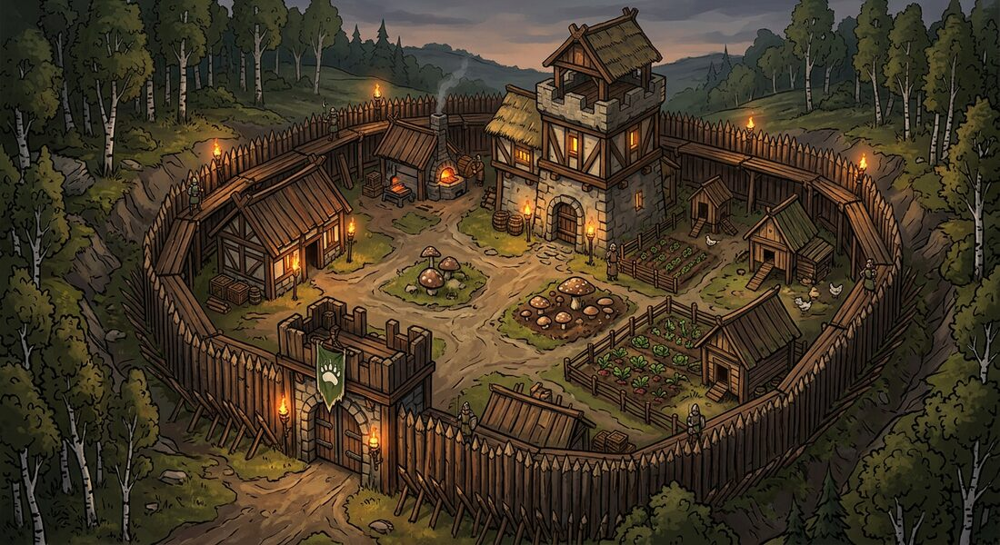

# Вид игры: план разбора и создания UI

Документ о **внешнем виде игры**. Статус: **план и обсуждение**; решения о стиле не приняты — их принимает
заказчик после разбора и вариантов.

Связанные документы: [02-tone.md](02-tone.md) — голос и правила текста, [03-first-session.md](03-first-session.md) —
первый запуск, [16-money.md](16-money.md) — прибыль и удержание, [06-plan.md](06-plan.md) — шаги работы.

---

## 0. Решения заказчика (25.09.2026)

1. **UI ведём параллельно с разработкой**, стиль выбирается по анализу, а не по вкусу.
2. **Список 12 игр для разбора утверждён** (раздел 4).
3. **Ширина разбора — всё визуальное целиком**: интерфейс, карта, бой, двор, герои как сцены.
4. **Процесс работы:** разбор и тренды → чёткий **план (скелет) создания UI** → из скелета **до 10 вариантов**
   → из большинства вариантов выбрать «идеальный» и уникальный стиль.
5. **Учитывать рекламу** и **централизацию нескольких главных элементов** — «фишки», «якоря» игры (раздел 10).
6. **Наша изюминка** — баланс строгости, шутки, сарказма и иронии проекта (по [02-tone.md](02-tone.md)).
7. **Хотим анимированный 3D-визуал**, «двигаться вровень с современным миром» (раздел 9 — что реально
   возможно и почём).
8. **Полнота разбора (26.09.2026):** каждую игру изучаем не по одним статичным экранам: смотрим реальные
   игровые кадры и видео, петлю и системы игры, двор, карту, бой, героев и события, 3D-сцену и камеру,
   анимацию, обратную связь и эффекты. Игровые механики связываем с [14-genre-core.md](14-genre-core.md) и
   [15-genre-deep.md](15-genre-deep.md), не дублируя их. В карточке отделяем **наблюдаемый факт**,
   **вывод** и **что применить в TDL**; рекламу, постановочный трейлер и реальный игровой процесс помечаем
   раздельно. Технические детали (движок, модели, FPS) не угадываем по картинке. Цель — найти собственный
   узнаваемый язык TDL, а не скопировать чужую оболочку.

**Отменено (25.09.2026):** три первых концепта стиля и папка `docs/game/concepts/` — они строились от наброска
заглушки, а не от разбора жанра (раздел 7).

---

## 1. Порядок работы (семь этапов)

| Этап | Что делаем | Выход | Кто утверждает |
|---|---|---|---|
| **1. Разбор 12 игр + антипример** | единая карточка из 20 пунктов (раздел 5), игровые кадры и видео, официальные материалы; механики сверяем с документами 14–15 | 13 карточек: 12 целевых + King of Avalon | заказчик принимает |
| **2. Сводка** | «роль → как решают все → разброс»; карта уникальности (где тесно, где пусто); «за что ругают → что делаем иначе» | сводная таблица | заказчик обсуждает и правит |
| **3. Скелет UI** | **план интерфейса без стиля**: экраны, раскладка, иерархия, якорные элементы, состояния, навигация, что где живёт — выведен из разбора | документ-скелет (проволочные схемы) | **заказчик утверждает** |
| **4. До 10 вариантов** | 8–10 вариантов стиля **на одном и том же скелете**: палитра, материал, форма, свет, иконки, портрет, двор | 10 изображений + таблица отличий | **заказчик выбирает** |
| **5. Лист вида** | палитра по ролям, шрифты, рамка, свет, один портрет, один замок, три ресурса, одна кнопка | лист вида | **заказчик утверждает** |
| **6. Набор интерфейса** | кнопка, панель, полоса, таймер, окно, лента, иконки трёх размеров | UI-кит в коде | правит заказчик |
| **7. Экраны** | двор, карта, отчёт; далее экраны шагов 4–9 собираются из набора | живые экраны | смотрит на устройстве |

**Правило:** ни одного решения о виде до конца этапа 1; ни одной картинки «от себя» вместо анализа.
Варианты на этапе 4 обязаны быть **на одном скелете** — иначе сравнивать нечего, и выбор превращается в лотерею.

---

## 2. Рынок: цифры

| Показатель | Значение | Источник |
|---|---|---|
| Выручка жанра «стратегии», 2025 | **$17,5 млрд**, 5,4 млрд загрузок | Sensor Tower / Statista через Quantumrun |
| №1 по выручке 2025 | **Last War: Survival** — ~$1,57 млрд (+42%) | AppMagic |
| №2 | **Whiteout Survival** — ~$1,40 млрд | AppMagic |
| Новинка года | **Kingshot** — ~$448 млн | AppMagic / Business of Apps |
| Выручка на установку (Whiteout) | **$20,83** при 54-м месте по загрузкам | Singular |
| ARPDAU (iOS, США) | Last War **$2,47** против Whiteout **$1,08** | Naavik |
| Удержание верхней четверти 4X | D1 **45–55%**, D7 20–25%, D30 10–15% | ThinkingData |

**Вывод для вида:** жанр зарабатывает тем, что игрока не бросают. Вид оценивается не по «вау», а по тому,
понимает ли человек, что делать, и возвращается ли.

---

## 3. Первые фактические наблюдения (официальные материалы)

- **Kingshot:** яркий мультяшный 3D — зелёная трава, голубое небо. Панель выбора **светлая, пергаментно-
  песочная, со скруглениями**, варианты объёмными картинками, выбранный обведён угловыми скобками; фон
  под панелью затемнён. Слева сверху — портрет лорда с числом уровня; по центру — **две шкалы времени**;
  строка ресурсов с маленькими иконками и сокращёнными числами (213,76K; 12,490,736). Мрачности нет.
- **Whiteout Survival:** **реклама ярче игры** — мультяшная сцена, зелёные ёлки, синяя плашка «Collect Resources».
  Подтверждает жалобы «в игре не то, что в ролике».
- **Rise of Kingdoms:** насыщенный мультяшный 3D, крупный харизматичный герой; ниже — **городские облики
  по цивилизациям** (Рим, Британия, Испания, Франция, Китай, Япония, Корея). Внешний вид города — товар.

**Вывод:** мрачность — не язык жанра. Яркость, контраст и читаемость — язык. Облик города продаётся.

---

## 4. Список игр для разбора (утверждён)

**Лидеры рынка:** 1. Whiteout Survival · 2. Last War: Survival · 3. Kingshot · 4. Rise of Kingdoms · 5. Evony.
**Жанровые:** 6. Game of Thrones: Conquest · 7. State of Survival · 8. Lords Mobile · 9. Call of Dragons ·
10. Warpath.
**Дополнительно:** 11. Age of Empires Mobile · 12. Puzzles & Survival · 13. King of Avalon (антипример).

Здесь **12 целевых игр и один отдельный антипример** — всего 13 карточек. King of Avalon нужен как
контрастный пример, а не как тринадцатая целевая игра.

---

## 5. Карточка разбора (20 пунктов, на каждую игру)

1. **Экран двора** — ракурс камеры, зум, разметка построек, показ прогресса.
2. **HUD** — что сверху (ресурсы, часы, власть) и снизу (навигация): сколько пунктов, размеры, подписи.
3. **Панели и окна** — материал и форма: пергамент, стекло, металл; скругления, тени, свечение, рамки.
4. **Кнопки** — форма, цвет, состояние (нажато/недоступно/ждёт), подача главного действия.
5. **Палитра по ролям** — фон, панель, действие, награда, опасность, редкость; сколько цветов и где золото.
6. **Иконки ресурсов** — 3D-рендер или вектор, детализация, читаемость в 24/32/48 px.
7. **Герои и лорд** — стиль, позы, фон, как продают (звёзды, редкость, облики).
8. **Карта** — сетка/свободная, маркеры, зум, зоны, «где я» и «куда идти».
9. **Бой** — как показан (марши, стрелки, цифры, полосы); что в рекламе и что в игре.
10. **Событие и календарь** — как рисуют «сегодня», таймеры, награды, вход в событие.
11. **Союз** — чат, роли, помощь, «принадлежность» в интерфейсе.
12. **Магазин** — где стоит, как подают наборы, что подсвечивают.
13. **Онбординг** — первые 5 минут: что показывают, сколько текста и окон.
14. **Фишка (уникальность)** — что делает игру узнаваемой **на одном экране**.
15. **Реклама против игры** — обещание ролика против реального экрана (наш принцип: реклама = игра).
16. **Тон и голос** — как игра шутит, где шутит и где молчит; где строгость, где ирония (сверяем с нашим
    [02-tone.md](02-tone.md): строгая рамка, ироничная подпись).
17. **Петля и системы** — что игрок повторяет; строительство, экономика, исследования, герои, армия, бой,
    карта, союз и события. Подробную математику не копируем сюда, а связываем с [14-genre-core.md](14-genre-core.md)
    и [15-genre-deep.md](15-genre-deep.md); отдельно отмечаем, что задаёт темп и возвращает игрока.
18. **3D-сцена** — ракурс и движение камеры, глубина, масштаб и силуэты моделей, материалы, свет, окружение;
    только то, что видно в самой игре, а не предположения о движке или производственном пайплайне.
19. **Анимация и эффекты** — idle/окружение, стройка/улучшение, марш, бой и способности героев, переходы UI,
    появление наград, частицы/свечение/удары; что помогает понять действие, а что служит зрелищности.
20. **Доказательность** — платформа и версия, источник и дата; у видео — тайм-коды. Каждый вывод помечен как
    наблюдение, интерпретация или гипотеза для TDL. Если доступно только промо или статичный кадр, так и пишем.

**Формат:** карточка фактов с 2–4 кадрами из игры, ссылками на реальные игровые видео и тайм-кодами анимаций
(если доступны), строками «что берём / что не берём и почему» и источниками. Промо-ролики и реклама помечаются
отдельно от gameplay. В конце — сводная таблица по всем играм и карта уникальности TDL.

---

## 6. Скелет UI — что это будет (этап 3)

Скелет — это **ответы на вопросы, а не картинки**:

1. **Карта экранов:** какие экраны есть, как между ними ходят, что где живёт (двор, карта, отряд, командир,
   отчёт, союз, события, настройки).
2. **Раскладка по зонам:** что в нижней трети (главное), что в верхней (статус), что в центре (сцена).
3. **Иерархия:** что видно всегда, что по тапу, что только в событии.
4. **Состояния:** пусто, идёт (таймер), готово, ошибка, заблокировано — для каждого элемента.
5. **Навигация:** сколько пунктов, их порядок, что открывается свайпом.
6. **Якорные элементы** (раздел 10): какие 3–5 элементов повторяются везде и становятся «лицом» игры.
7. **Роли цвета:** фон, панель, действие, награда, опасность, редкость — сколько их и где применяются.
8. **Правила плотности:** сколько информации на экран, где прячем мелочь (по жалобам «завалили окнами»).

Скелет утверждается **до** любого арта. Только потом рисуются варианты.

---

## 7. Что отменено и почему

| Отменено | Причина |
|---|---|
| Три концепта стиля (гравюра, премиум, спора) | построены от чёрно-костяной заглушки, а не от разбора жанра |
| Рекомендация «гибрид» | вывод без разбора |
| Папка `docs/game/concepts/` | удалена |
| Чёрная палитра `#0c0a09` как «основа вида» | это временная заглушка шага 3, а не решение |

---

## 8. Технические нормативы (не стиль — стандарты)

- **Зона пальца:** главные действия в нижней трети (75% взаимодействий — одним пальцем).
- **Цель нажатия ≥ 44–48 px** (уже в коде).
- **3–5 пунктов** навигации, иконка + короткая подпись.
- **Контраст текста ≥ 4,5:1**; состояние не только цветом.
- **Тёмная и светлая тема** — обе полноценные.
- **Размытие и «стекло»** — только в оверлеях и при запасе производительности.
- **Анимации 150–250 мс**, только `transform`/`opacity`; цель 60 fps в бою, 30+ в городе.
- **Вес:** первый экран ≤ 300 КБ до первой отрисовки; иконка-вектор ≤ 3 КБ; портрет ≤ 80 КБ; первый вход ≤ 1,5 МБ.
- **Никаких внешних CDN:** все ассеты (шрифты, модели, HDRI) — у нас на сервере или в бандле (в РФ внешние
  CDN нестабильны).
- **Доступность:** `prefers-reduced-motion`, `safe-area-inset` (уже включено), масштабирование шрифтов.

---

## 9. 3D, анимации и честные возможности

### 9.1 Что важно понять про «2D не в моде»

Посмотрел официальные экраны лидеров: **3D у них — это сцена** (город, карта, бой), а **интерфейс — плоский
2D** (пергаментные панели Kingshot, панели RoK поверх 3D-города). То есть «3D-игра» = 3D-сцена + 2D-интерфейс,
а не «всё 3D». Смешивать эти два слоя — типичная ошибка, из-за неё интерфейс становится тяжёлым и нечитаемым.
Наш план: **сцена — 3D, интерфейс — плоский и мгновенный.**

### 9.2 Что проверено в нашем окружении (факты)

| Проверка | Результат |
|---|---|
| `three` (ядро 3D) | доступен, **0.186.1** |
| `@react-three/fiber` (React-обвязка 3D) | доступен, **9.8.1** |
| `@react-three/drei` (готовые камеры, свет, окружение) | доступен, **10.7.9** |
| `@react-three/postprocessing` (свечение, качество) | доступен, **3.1.2** |
| `@gltf-transform/cli` (сжатие моделей) | доступен, **4.5.0** |
| `@pmndrs/assets` (готовые окружения) | доступен, **1.7.0** |
| 3D-редактор в песочнице (Blender и др.) | **нет** |
| Сайты моделей (Kenney, Quaternius, Sketchfab) | **недоступны** из песочницы |
| Ресурсы | 2 ядра, 3 ГБ памяти — хватает для кода, не для 3D-рендера |

### 9.3 Что я умею и чего не умею (прямо)

**Умею:** писать 3D-код (сцена, камера, свет, тени), шейдеры (свет грибницы, споры, туман), процедурную
геометрию — то есть **строить город и постройки кодом** из параметрических модулей (стена, башня, дом, крыша,
знамя), анимации, загрузку и сжатие моделей, постобработку, а также 2D-интерфейс и его анимации.

**Не умею:** лепить 3D-модели руками — в песочнице нет 3D-редактора, и «нарисовать» модель как картинку
нельзя. Значит, «мясистые» модели (герой, вождь, детализированный двор) — это **покупка готовых или наём
3D-художника**, а не то, что я достану из воздуха.

### 9.4 Три реальных пути (и что рекомендую)

| Путь | Как | Цена | Вид |
|---|---|---|---|
| **A. Процедурный стилизованный 3D** | город и здания **генерируются кодом** из модулей; свет и споры — шейдерами; модели-модули можно потом заменить купленными | почти только работа (модели не покупаем) | низкополигональный стилизованный 3D, «игрушечный» и яркий (как низкополи Kingshot/Brawl Stars) |
| **B. Покупные/заказные модели** | покупаем набор «фэнтези-город» или заказываем лорда, вождей, двор | от десятков до сотен тысяч ₽ | ближе к Whiteout/RoK, «премиум» |
| **C. Пре-рендер 2.5D** | 3D-сцену рендерят один раз в изображения, в игре — картинки и спрайтовые анимации | средне, нужен 3D-художник | выглядит как 3D, но камера фиксирована (нельзя вращать) |

**Рекомендую A с заделом на B:** начинаем с процедурного стилизованного 3D — он даёт **настоящую 3D-сцену**
(камера, свет, рост города на глазах), лёгкий вес и полную независимость от закупок; наш язык (грибница, споры,
свечение) отлично ложится на шейдеры. По мере денег заменяем ключевые модули (двор, лорд, вожди) на купленные
или заказанные — сцена это переживёт, потому что модульная.

### 9.5 Анимации: что именно делаем

- **Сцена:** вращение и зум камеры, рост и стройка зданий, движение маршей, живой свет, споры и туман.
- **Персонажи:** покадровые анимации из моделей (если модель с анимациями) или простое движение кодом
  (поворот, покачивание, удар) — для стилизованного вида этого достаточно.
- **Интерфейс:** микроанимации нажатий, появление панелей снизу, счёт цифр, «свечение награды» — CSS/WAAPI.
- **Награды и события:** векторные анимации (Lottie) + свечение; это то, что приятно получать.
- **Бюджет:** 60 fps в бою, 30+ в городе на среднем телефоне; на слабом — фолбэк: статичная изометрия
  вместо живой сцены, интерфейс остаётся.

### 9.6 Браузер в песочнице: выяснено на деле (поправка 25.09.2026)

Заказчик был прав: браузер **ставится**. Проверено: скачан пакет `@sparticuz/chromium` (69 МБ), распакованы
его библиотеки совместимости (`al2023`: nspr/NSS) и SwiftShader, после чего **Chromium 153.0.8010.0
запускается** и отвечает на `--version` (нужны `LD_LIBRARY_PATH`, `FONTCONFIG_FILE`, флаги `--headless
--no-sandbox`).

Но **рендеринг страницы в этом контейнере виснет**: GPU-процесс не поднимается (`GLDisplayEGL::Initialize
failed`), кадр не отдаётся. Пять наборов флагов — новый и старый headless, `--single-process`, `--no-zygote`,
SwANGLE + `--enable-unsafe-swiftshader`, отключение сети и обновлений — дают одно и то же: процесс живёт,
снимка нет (все запуски под `timeout`, чтобы не вешать среду).

**Итог:** установка — да, скриншоты — нет. Значит, кадры и «тянет ли на телефоне» смотрите вы через превью,
а я даю код, нормативы и замеры веса и размеров, которые проверяются без браузера. Если автоматическая
проверка картинки нужна — это решение о среде (внешний браузер или сервис), а не вопрос флагов.

---

## 10. Якорные элементы (фишка игры)

Ваша идея: **централизовать несколько главных элементов**, которые станут «якорем» узнаваемости. Как это
устроено у лидеров: Whiteout — снег, печь, дым; RoK — цивилизации и герои; Last War — техника и дрон.

**Наши кандидаты в якоря** (выбрать 3–5 и повторять везде — в интерфейсе, на карте, в рекламе, в иконке):

1. **Грибница и споры** — живой свет, который означает «наше». Работает как язык наград и редкости.
2. **Знамя двора** — личное и клановое, дешёвый носитель статуса (и товар — облики знамени).
3. **Хроника** — лента событий как «летопись мира»: и механика, и лицо игры, и повод шутить.
4. **Погреб с грибами** — редкий ресурс: место, куда хочется заглядывать.
5. **Частокол** — граница «своё/чужое» на карте, читается мгновенно.

**Правило якоря:** элемент обязан быть узнаваем **на одном экране и без подписи**; если для понимания нужен
текст — это не якорь.

---

## 11. Тон в интерфейсе

Из [02-tone.md](02-tone.md): «ирония — приправа, не блюдо», «на кнопках шуток нет», «шутит хронист и подписи».
Для вида это значит:

- **Рамка и форма — строгие** ( никакого клоунского шрифта и радуги на весь экран).
- **Ирония — в микротекстах и деталях**: подпись к пустому полю, фраза хрониста в ленте, название нелепого
  здания, реплика при провале, но **не на экране поражения и не на кнопке**.
- **Серьёзность ставок** читается из оформления (щит, стены, потери), а шутка — рядом, тонкой линией.

---

## 12. Что нужно от заказчика

| № | Вопрос | Варианты |
|---|---|---|
| 1 | Порядок этапов (раздел 1) | утвердить / поправить |
| 2 | Скелет: сначала 1 эталонный экран (двор) как образец скелета, потом остальные | образец / сразу все экраны |
| 3 | **Прототип 3D-сцены** (проверка на вашем телефоне до всего остального) | делаем / сначала скелет и разбор |
| 4 | Якорные элементы (раздел 10) | выбрать 3–5 из списка / добавить свои |
| 5 | Путь 3D (раздел 9.4) | A процедурный / B покупные модели / A с заделом на B (рекомендую) |

---

## 13. Разбор партии 1 (25.09.2026): Whiteout · Last War · Kingshot · RoK

Смотрел **настоящие экраны игры** (скриншоты из магазинов приложений и гайдов), а не описания. Ниже — только
то, что видно глазами.

### 13.1 Whiteout Survival — панель постройки

Экран: панель печи/кухни поверх затемнённой сцены.

- **Шапка панели** — тёмно-синяя полоса: слева название и уровень («Cookhouse Lv. 8») с иконкой подсказки,
  **справа — ярко-синяя кнопка улучшения**.
- **Тело панели** — светлое, контрастное к шапке: слева превью здания (скруглённый квадрат с картинкой),
  рядом название и одна строка описания обычным текстом.
- **Чипы характеристик** — узкие скруглённые плашки в два ряда: «Production 🍗 1», «Cost 🥩 464.11K/150»,
  «Stats 🍖 50», «Time ⏱ 3.4S **−0.2S**». Скидка времени написана **зелёным прямо рядом с временем**.
- **Сетка плиток** — 5 столбцов × 3 ряда: светлые квадраты с зданием, уровень числом в углу
  («16», «14») и **зелёным плюсом** у тех, что можно улучшить; выбранная обведена **голубыми угловыми
  скобками**.
- **Низ — две вкладки** во всю ширину: «Furniture» / «Survivor», активная светлее.
- **Числа** сокращённые: «464.11K», «3.4S», вверху счётчик «0/24» красным и зелёным.
- **Палитра:** тёмно-синий, светло-голубые плитки, белый текст, золото на цене, **зелёный = выгода**.

### 13.2 Last War: Survival — двор

- **Сцена:** изометрия, яркая зелень, песочные дорожки, насыщенные постройки; читается мгновенно.
- **Бейджи над зданиями:** круглые белые облачка с иконкой (молоток — есть что строить, посылка, маска,
  монета) висят прямо над постройкой; это главный способ сказать «сюда смотри».
- **Флаг в центре двора** — национальный (Испания): принадлежность вынесена в центр сцены.
- **Боковая колонка** круглых кнопок слева; чат — отдельной круглой кнопкой.
- **Палитра:** самая яркая из четырёх; синий и оранжевый на зелёном.

### 13.3 Rise of Kingdoms — карта и город

- **Карта:** реалистичный рельеф **без сетки**, огромный зум-аут, поверх — маркеры армий; посередине
  надпись расстояния («232 KM»).
- **Верхняя строка:** портрет с уровнем слева, затем **семь ресурсов** подряд: «3,387,325», «2,584,620»,
  «7,6M», «8,7M», «3,6M», «1,5M», «170» — и **полные числа, и сокращённые в одном экране** (наследие
  старого интерфейса).
- **Правая колонка** — 6–7 круглых кнопок с золотыми иконками (почта, поиск, события, подарки, чат).
- **Чат союза виден прямо на карте** — социальное не спрятано в меню.
- **Город:** плотная изометрия, много украшений, стены; отдельный экран.
- **Палитра:** насыщенная зелень, серый камень, золото.

### 13.4 Kingshot — выбор объекта

- **Модальная карточка:** светло-пергаментная, крупные скругления; шапка светлее тела.
- **Два варианта в ряд**: объёмный 3D-рендер на светло-голубом квадрате, под ним название обычным текстом;
  выбранный обведён **теми же голубыми угловыми скобками**, что у Whiteout.
- **Сцена за карточкой затемнена**; поверх — **синяя плашка-баннер с крупной надписью заглавными**
  («CHOOSE YOUR TOWER») — подача «событийности».
- **Верх:** портрет лорда в короне с золотым бейджем уровня слева; чипы времени и валют справа
  («23:06», «32/32», «213,76K», «12,490,736»).

### 13.5 Сводка: что у жанра общее (это и есть язык)

| Место | Как решают все четыре | Вывод для нас |
|---|---|---|
| Верхний край | портрет слева + чипы времени и ресурсов, числа сокращённые | берём: компактная строка, не более двух рядов |
| Нижний край | 5 пунктов с иконкой и подписью; у RoK — колонка круглых кнопок сбоку | берём нижнюю навигацию из 5; боковую колонку — для редких действий |
| Сцена | изометрия 3/4, яркая, плотная, «игрушечная» | берём изометрию; яркость — да |
| Панель | снизу; шапка тёмная, **главная кнопка справа в шапке** | берём: главное действие в шапке панели, справа |
| Выбор | **голубые угловые скобки** (Whiteout и Kingshot) | берём: это уже стандарт жанра |
| Плитки | сетка 5×3, уровень числом в углу, **зелёный «+» у доступных** | берём: зелёный «+» = «можно улучшить» |
| Выгода | зелёный цвет времени и скидок («−0.2S») | берём: зелёный — язык выгоды, не украшение |
| Внимание | круглые бейджи над объектами (Last War) и цифры-счётчики (Whiteout) | берём: 3–5 бейджей максимум, иначе шум |
| Социальное | чат на карте у RoK, флаг двора у Last War | берём: принадлежность видна на сцене |
| Числа | сокращения «K», «M» рядом с точными | берём сокращения, но **точное число — в один тап** |
| Модальные окна | затемняют сцену, но **сами не открываются** — открывает игрок | берём: у нас окно только по действию |

**Чего не берём:** семь ресурсов в строке (RoK) — у нас пять, и лучше не расширять; смесь полных и
сокращённых чисел в одном ряду; рекламные плашки поверх игры (это приём магазина, не интерфейса).

### 13.6 Визуальные отличия TDL после проверки канона

Сверка с [01-lore.md](01-lore.md) и [02-tone.md](02-tone.md) отменила прежнюю идею «свечение грибницы как язык наград»:
Мать мертва, грибы молчат и не становятся магическим источником света. Старый пункт выше не использовать.

1. **Архитектура удерживает двор.** Крыша, деревянная стена, работа и личное знамя читаются через силуэты и детали
   сцены, не через магические линии или говорящие объекты.
2. **Хроника — контекст, не шум.** Короткая строка летописи может пояснять событие; кнопки и состояния остаются
   буквальными, без шутки в момент потери.
3. **Строгая рамка, живая зимняя сцена.** Bone-Wood: светлая костяная/пергаментная вставка и тёмная древесина
   держат HUD; сцена двора остаётся открытой и бытовой. Кость — цвет поверхности UI, не новый ресурс.

---

## 14. Макет: что сделано и что проверить

Собран **живой макет двора** — файл `docs/game/ui/mockup.html`, открывается с телефона (превью на порту 8080).
Это **скелет в коде**, а не финальный вид: цвета — переменные, картинка сцены — тестовая и переключается.

**Что в макете (по итогам §13):**

- верх: портрет лорда с уровнем, часы мира, **зелёный чип выгоды**, строка из пяти ресурсов с сокращениями;
- сцена: изометрия двора (тестовая картинка — 4 настроения, переключатель внизу слева);
- **бейджи над объектами**: молоток (есть что строить) и галочка с числом (готово);
- **боковая колонка** круглых кнопок (почта, события, союз) — приём RoK;
- **нижняя навигация из 5 пунктов** с иконкой и подписью, в зоне пальца;
- **панель постройки снизу**: тёмная шапка, название с уровнем, **«Улучшить» справа в шапке**, чипы
  характеристик (включая зелёную экономию времени), сетка **5×3** с уровнем в углу и зелёными «+»,
  выбранная плитка — голубыми скобками, низ — две вкладки;
- свайп вниз по шапке закрывает панель; кнопка «Улучшить» показывает состояние «улучшается».

**Что проверить заказчику (по пунктам, на телефоне):**

1. Читается ли строка ресурсов на 390 px и не мелко ли.
2. Пять пунктов внизу — удобно ли большим пальцем, хватает ли подписей.
3. Панель постройки: понятно ли с первого взгляда, что улучшить и сколько это стоит.
4. Бейджи: помогают или мешают (сколько их терпимо).
5. Настроения сцены (кнопки 1–4): какое ближе — яркое дневное, холодное, крафтовое или светящееся ночное.
6. Чего не хватает на экране двора, что лишнее.

**Важно:** этот макет — **скелет**. Стиль (палитра, материал рамок, шрифт, свет) ещё не выбран; когда
выберем — меняются только переменные в начале файла, раскладка остаётся.

### 14.1 Тестовые генерации (тот же ракурс, четыре настроения)

Один и тот же сюжет — двор с частоколом, башней, воротами и грибной грядкой — в четырёх настроениях.
Это **не варианты стиля целиком**, а проверка: как скелет читается на разном свете и цвете.

| № | Настроение | Изображение |
|---|---|---|
| 1 | Яркое дневное (язык Kingshot/Last War) |  |
| 2 | Холодное сумеречное (язык Whiteout) |  |
| 3 | Крафтовое земляное (своё, «дерево и кость») |  |
| 4 | Светящееся ночное (наша спора) |  |

В макете эти же четыре картинки переключаются кнопками 1–4 внизу слева — можно смотреть, как панели
и бейджи ведут себя на каждом фоне. Файлы лежат рядом с макетом: `docs/game/ui/scene-*.jpg`.

**Как открыть макет.** Из каталога `docs/game/ui` поднимите статический сервер и откройте превью на телефоне:

```bash
cd docs/game/ui && python3 -m http.server 8080 --bind 0.0.0.0
```

---

## 15. Разбор партии 2 (26.09.2026): Evony · Game of Thrones: Conquest · State of Survival · Lords Mobile

**Это исследовательский проход, не выбор стиля TDL.** Каждая игра ниже размечена по всем 20 полям шаблона.
Сверены актуальные официальные страницы/заметки и публичные скриншоты; для движений дополнительно найдены
отдельные записи gameplay. Скриншот подтверждает композицию, но не анимацию; рекламный ролик или витринная
картинка не считаются доказательством игрового цикла. Где текущий клиент или динамика не проверены, это
отмечено явно как открытый вопрос. Математику и полную экономику не пересказываю — см.
[14-genre-core.md](14-genre-core.md) и [15-genre-deep.md](15-genre-deep.md).

**Настоящий UI показываю отдельно от рекламы:** см. галерею фактических игровых кадров в §15.7. Скриншоты
Google Play/App Store и рекламные композиции ниже помечены как витрина и не используются как доказательство
постоянного HUD. Большинство доступных реальных кадров архивные; они показывают структуру экрана, но не
подтверждают вид текущей версии.

### 15.1 Evony: The King’s Return

**Карточка по шаблону из 20 пунктов — первый проход.** «Не проверено» означает, что это открытый вопрос, а не вывод.

| № | Пункт | Наблюдение / статус доказательств |
|---:|---|---|
| 1 | Двор | Архивный кадр показывает плотный изометрический город и радиальное меню выбранной постройки; актуальность камеры/HUD для клиента 2026 не проверена. |
| 2 | HUD | В кадре видны уровень стены, верхний правый event-таймер и кнопка меню; полный верх/низ интерфейса и размеры зон не сняты. |
| 3 | Панели | Окно NPC Subordinate City — тёмный полупрозрачный лист поверх размытой карты; название, тип, характеристики и войска сгруппированы в одном окне. |
| 4 | Кнопки | В окне цели — большая зелёная Attack в бронзовой рамке, предупреждение Winning Odds красным; в радиальном меню — зелёная Upgrade. Состояния disabled/pressed не проверены. |
| 5 | Палитра | На кадрах город — зелень и серый камень; панель — угольная/коричневая с золотой окантовкой; зелёный = действие/улучшение, красный = опасность. |
| 6 | Иконки ресурсов | Мелкие квадратные цветные пиктограммы и медальоны типов войск видны в панели цели; читаемость на 24/32 px не измерена. |
| 7 | Герои и лорд | Официально заявлены исторические генералы; в старом окне — портрет генерала в круглой золотой рамке и ряд воинов. Экран коллекции/редкости не изучен. |
| 8 | Карта | Издатель описывает живую карту с движением армий, монстрами и соперниками; актуальную карту в самой игре в этом проходе не зафиксировали. |
| 9 | Бой | До атаки NPC видны числа войск, риск потерь и «Extremely Low» шанс победы. Это полезное предупреждение до действия; марш и сама битва не наблюдались. |
| 10 | Событие / календарь | В кадре города есть event-бейдж с таймером; текущий Google Play показывает событие Wine Festival. Полный календарь и маршрут входа не изучены. |
| 11 | Союз | Официальное описание подтверждает альянсы, голосовой/текстовый чат и автоперевод; расположение этих функций в UI не наблюдалось. |
| 12 | Магазин | Кадр содержит «90% OFF», но источник/контекст не даёт доказать, что это постоянный HUD или открытый магазин. Магазин не просмотрен; бейдж помечаю как сомнительный промо-слой. |
| 13 | Онбординг | Первые пять минут не проверены; нельзя судить о числе подсказок и темпе обучения. |
| 14 | Фишка | Подтверждены семь цивилизаций с разной архитектурой и бонусами плюс исторические генералы; визуальная смена города — кандидат на узнаваемый якорь игры. |
| 15 | Реклама против игры | Текущий store-листинг показывает shooter-креативы и отдельно перечисляет Survivor Levels/puzzles. Официальный разбор рекламы отличает barrel-runner креатив от стратегического core loop; наличие похожего режима и его путь надо проверять в живом клиенте. |
| 16 | Тон и голос | Тон магазина — «империя/король/исторические генералы»; текст в окне боя сухо предупреждает о потерях. Полный голос заданий/диалогов не изучен. |
| 17 | Петля и системы | Город, ресурсы, исследования, генералы, войска, живая карта, монстры, альянсы и серверные бои; отдельные puzzle/Survivor-активности сверяются отдельно от главной петли. |
| 18 | 3D-сцена | Изометрический город и отдельные здания видны в статичных кадрах. Не делаю выводов о движке, полигонах, свободе камеры или глубине сцены. |
| 19 | Анимация / эффекты | Издатель называет карту «stunningly animated»; найденная запись gameplay 2022 года старая и не была просмотрена покадрово. Текущие idle/марш/удар/стройка/VFX и тайм-коды — открыты. |
| 20 | Доказательность | Текущая Google Play карточка обновлена 22.09.2026; официальный обзор LiveOps датирован 03.09.2026; игровой скриншот архивный (2023), видео — 22.04.2022. Структура системы подтверждена лучше, чем свежий UI и движение. |

**Система / реальный цикл.** Официальный обзор описывает развитие города и технологий, генералов и
специализированные войска, живую мировую карту, монстров/соперников и альянсы; у семи цивилизаций разные
бонусы и архитектурная подача. Это основа для карточки, а не shooter-реклама.

**Что видно в материалах.** В архивном игровом скриншоте 2023 года город показан в изометрии; при выборе
объекта поверх сцены появляется затемняющаяся панель с крупным изображением NPC-города, короткими
характеристиками и ярким действием. В доступном снимке интерфейс плотный, с яркими акцентами и несколькими
слоями объектов. Возраст снимка — почти три года: детали HUD нельзя автоматически переносить на сборку 2026.
Текущая галерея магазина содержит lane-shooter-подачу. Официальная статья Evony отдельно разбирает
barrel-runner как рекламный креатив и отделяет его от стратегического core loop; при этом описание игры
упоминает Survivor Levels и puzzle-активности. Поэтому lane-runner здесь — **не доказательство главного
экрана или главного цикла**; наличие конкретного похожего режима нужно перепроверить в клиенте.

**3D / движение / отклик.** Официальный обзор называет карту анимированной, а сторонняя запись gameplay
2022 года показывает более старый реальный клиент (24:21). Текущие последовательности марша, атаки,
захвата города и строительного улучшения покадрово не проверены; тайм-кодов нет. Слова «анимированная карта»
фиксирую как заявление издателя, не как собственное измерение плавности или эффекта.

**Гипотеза для TDL, не решение:** полезно изучить, как архитектура цивилизаций делает выбор фракции заметным
прямо в городе. Не копировать набор цивилизаций, рекламные lane-креативы и плотность временных промо-слоёв.

**Материалы:** [официальный обзор систем Evony](https://liveops.evony.com/evony-tkr/),
[Google Play — актуальная карточка и галерея](https://play.google.com/store/apps/details?id=com.topgamesinc.evony&hl=en_US),
[официальный разбор shooter-рекламы](https://liveops.evony.com/evony-shooting-ads-review/),
[архивный скриншот игрового города / TalkAndroid (2023)](https://www.talkandroid.com/43154-evony-the-kings-return-walkthrough/),
[запись gameplay / Uptodown (2022, 24:21)](https://www.youtube.com/watch?v=pvbqWk4Varg).

**Два кадра из официальной витрины Google Play** (это именно store-материалы; не подтверждают core loop):


**Два игровых кадра из архива TalkAndroid (30–31.12.2023; не текущая сборка):**


### 15.2 Game of Thrones: Conquest

**Карточка по шаблону из 20 пунктов — первый проход.** Store-композиция Dragon customization отделена от доказательств UI. Проверяемый кадр Preset Manager (официальный guide, 2022) включён в [галерею](17-ui-real-screens.md); Arena Overview (2026) используется как текстовый источник, а прикреплённые изображения не удалось проверить визуально и они вынесены в список исключённых материалов.

| № | Пункт | Наблюдение / статус доказательств |
|---:|---|---|
| 1 | Двор | В архивном смешанном store-кадре видна небольшая изометрическая площадка с постройками; отдельный актуальный экран замка и его камера не проанализированы. |
| 2 | HUD | На кадре Dragon Pit сверху проходит ресурсная строка; другой архивный кадр показывает профиль/уровень, ресурсы и нижнюю панель задания. Полный HUD и размеры элементов не зафиксированы. |
| 3 | Панели | Тёмная подложка/табы Dragon Pit видны только в store-композиции с надписью «CUSTOMIZE YOUR DRAGON»; не использую это как точное доказательство внутриигровой панели. Реальный layout Preset Manager описан в [18-ui-deep-dive.md](18-ui-deep-dive.md). |
| 4 | Кнопки | Reset/Save/X видны в store-композиции Dragon Pit и не считаются эталонным raw UI. В официальном игровом Preset Manager 2022 подтверждены `Save` и `Save & Equip`; зоны касания/pressed/disabled не проверены. |
| 5 | Палитра | Store-картинка показывает камень/золото/красного дракона, но не служит основой UI-токенов. На игровом кадре Preset Manager 2022 видны тёмная фактурная поверхность, синие кнопки, золотые ползунки и отдельный красный Clear; переносить это в TDL как стиль нельзя. |
| 6 | Иконки ресурсов | Несколько мелких ресурсов в верхней полосе; цветовые ячейки настройки дракона крупнее. Читаемость на телефонном размере не измерена. |
| 7 | Герои и лорд | Текущий листинг заявляет 100+ героев; изученный кадр делает центром крупную модель дракона, не портрет лорда. Экран коллекции героев не изучен. |
| 8 | Карта | Фрагмент карты с мини-картой и координатами X:939/Y:127 есть только в архивной store-галерее; его не использую как raw-снимок. Скриншоты карты Uptodown 2017 — исторические; текущий зум/фильтры/марш не проверены. |
| 9 | Бой | Официальное описание подтверждает массовые PvP-сражения и северные PvE-сценарии; конкретная текущая расстановка Pawns, камера и боевой HUD не наблюдались. |
| 10 | Событие / календарь | Официальные патчи описывают Event Panel с видеоартом и инвентарными счётчиками; полного календарного экрана в кадрах нет. |
| 11 | Союз | Официальное описание подтверждает альянсы/аллегиансы и координацию kingdom wars; UI чата, ролей и помощи не изучен. |
| 12 | Магазин | Экран магазина/наборов не просмотрен; store-страницу не считаю внутриигровым магазином. |
| 13 | Онбординг | Первая сессия не проверена; сюжетный трейлер и рекламное превью не подменяют onboarding. |
| 14 | Фишка | Dragon Pit — крупный объект с выращиванием, именованием, кастомизацией и боевой ролью; это подтверждено официальным листингом и экраном настройки. |
| 15 | Реклама против игры | Dragon customization выглядит как in-game экран, но крупная титульная надпись может быть store-оформлением. В галерее также есть отдельно постановочные баннеры House of the Dragon/«Domina el mapa»; это не HUD. Видео 2019 года старое, трейлеры не считаю gameplay. |
| 16 | Тон и голос | Westeros задаёт серьёзную, мрачновато-героическую IP-подачу; тон коротких системных сообщений и юмор в игре не аудировали. |
| 17 | Петля и системы | Замок, исследования у Maester’s Tower, герои/экипировка, армия, альянсы, Seats of Power, dragon progression и ограниченные PvE-события. Математика остаётся в документах 14–15. |
| 18 | 3D-сцена | Крупный дракон виден в store-композиции Dragon Pit, но это не доказательство актуального игрового viewport/камеры. К Arena overview приложены image assets, однако их CDN-оригиналы не удалось проверить; выводов о сцене/камере из них не делаю. |
| 19 | Анимация / эффекты | Заметки 2026_08 исправляют проигрывание анимаций Pawns в Arena с экипированным драконом; заметки 2026_09 — производительность event-панели с видеоартом. Само движение и VFX не сняты. |
| 20 | Доказательность | Google Play обновлён 18.09.2026; официальные заметки — 17.08 и 15.09.2026; raw UI-гайд Preset Manager датирован 19.04.2022; текст Arena Overview — 20.05.2026 (прикреплённые image assets не проверены); архивные кадры Uptodown — 2017. Точные версии экранов и покадровая динамика не установлены. |

**Система / реальный цикл.** Замок, здания и исследования, набор армии, герои и экипировка, мировая карта,
альянсы и борьба за Seats of Power образуют стратегический слой. Дракон — отдельная система выращивания,
развития, экипировки и боевого применения; рядом существуют PvE-сценарии и временные события. Точные
коэффициенты и прогрессию оставляю в игровых документах.

**Что видно в материалах.** В просмотренных store-скриншотах экран Dragon Pit выносит крупную модель дракона
в центр, а настройки (окраска/части внешности и варианты выбора) — в отдельные панели/ячейки. Вокруг —
каменная тёмная подложка, золото и красные/синие акценты. Это узнаваемая IP-подача, а не нейтральный
ориентир для цвета TDL. Официальные заметки сентября 2026 показывают, что актуальная работа над UI включает
счётчик Dragon Lore, индикаторы доступных предметов события, вкладки закладок и фильтр материалов «можно
создать сейчас»; также разработчики отдельно исправляли производительность панели событий с видеографикой.
Игровой Preset Manager 2022 разобран отдельно по строкам войск, переключателю %/# и закреплённым действиям;
актуальный Arena flow описан по официальному тексту 2026 в [18-ui-deep-dive.md](18-ui-deep-dive.md). Прикреплённые к Arena
image assets не проверены визуально и не дают оснований описывать пиксели.

**3D / движение / отклик.** Заметки августа 2026 прямо фиксируют исправление, чтобы Pawns в Arena проигрывали
анимации, когда с ними экипирован дракон. Это подтверждает наличие соответствующих анимируемых фигур, но
не позволяет оценить их длительность, эффекты удара или камеру. Найденная публичная запись gameplay — 2019
год, поэтому она годится только как историческая подсказка, не как свидетельство нынешней сборки. Тайм-кодов
динамики нет.

**Гипотеза для TDL, не решение:** рассмотреть принцип «один крупный объект — отдельное пространство
настройки — ясные варианты выбора». Не заимствовать готические рамки, золото и конкретный язык драконьего
меню; для TDL сначала нужен собственный объект и собственный материал.

**Материалы:** [Google Play — актуальная карточка и галерея](https://play.google.com/store/apps/details?id=com.wb.goog.got.conquest&hl=en_US),
[официальные заметки 2026_09](https://www.gotconquest.com/news/2026/09/15/release-notes-2026_09),
[официальные заметки 2026_08](https://www.gotconquest.com/news/2026/08/17/release-notes-2026_08),
[Arena Overview — текст режима, 20.05.2026; изображения не проверены](https://www.gotconquest.com/news/2026/05/20/arena-overview/),
[Preset Manager Guide с реальным экраном (19.04.2022)](https://www.gotconquest.com/news/2022/04/19/preset-manager-guide-organize-your-gear-hero-council-and-march-presets/),
[официальное превью сентябрьского контента](https://www.gotconquest.com/news/2026/09/01/september-preview-dragonseeds/),
[архивные скриншоты Uptodown (2017)](https://blog.en.uptodown.com/game-of-thrones-conquest-android/),
[запись gameplay (2019)](https://www.youtube.com/watch?v=XGBx73pWBmU).

**Два кадра из официальной витрины Google Play** (store-галерея; проверять отдельно от trailer/рекламы):


**Два архивных игровых кадра / Uptodown (2017; исторические, не текущая версия):**


### 15.3 State of Survival

**Карточка по шаблону из 20 пунктов — первый проход.** Экран поселения — вторичный скриншот BlueStacks за 2024 год; официальная витрина 2026 включает рекламные композиции.

| № | Пункт | Наблюдение / статус доказательств |
|---:|---|---|
| 1 | Двор | На кадре BlueStacks 2024 — поселение сверху под углом, отдельные сооружения и периметр. Планировку и камеру текущей сборки не подтверждали. |
| 2 | HUD | В кадре видны Battle Power/Prosperity слева, профиль и ресурсы сверху, Skip вверху справа, Build справа снизу. Полный постоянный HUD не снят. |
| 3 | Панели | В обучающем/сюжетном кадре нижнюю часть занимает полупрозрачная коричневая диалоговая панель; персонаж крупно вынесен слева поверх сцены. |
| 4 | Кнопки | Видны Skip и круглая Build-кнопка; подсказка-указатель у нижнего края. Нажатое/заблокированное состояния и точные зоны касания неизвестны. |
| 5 | Палитра | Сцена пыльная: серо-коричневый грунт, хаки/оливковые объекты, тёплый костёр; диалог тёмно-коричневый, зелёный выделяет слово/действие. |
| 6 | Иконки ресурсов | На верхней полосе видны еда, дерево и расходник с сокращёнными значениями; микроразмер/контраст не измерены. |
| 7 | Герои и лорд | Becca показана крупным реалистичным портретом; официальный листинг отдельно продвигает героев. Профиль лорда/редкость героев не проверены. |
| 8 | Карта | В этом кадре только поселение; мировая карта, её зум/маркеры и перемещение отрядов не наблюдались. |
| 9 | Бой | Explorer Trail описан как отдельный hero-PvE с волнами; community tutorial 2025 говорит о трёх героях, ручном/авто-бое и запуске навыков. Боевой HUD/VFX визуально не разобраны. |
| 10 | Событие / календарь | Официальный Play-листинг перечисляет Survival Royale, Desert Survival и Puzzle Party; экран календаря/таймеров/награды не снят. |
| 11 | Союз | Официальное описание подтверждает альянсы и кросс-серверные бои; чат, роли и помощь визуально не исследованы. |
| 12 | Магазин | Внутриигровой магазин и наборы не просмотрены. Коллаб-арт/надписи в витрине магазина приложения не считаю магазинным экраном. |
| 13 | Онбординг | Есть одиночный обучающий/сюжетный кадр с Becca и Skip; последовательность первых пяти минут, число окон и возможность пропуска целиком не проверены. |
| 14 | Фишка | Сочетание долгого управления убежищем с отдельными hero- и survival-режимами; визуальный якорь этого кадра — персонажный портрет поверх поселения. |
| 15 | Реклама против игры | Store-скриншоты накладывают крупные фразы и вырезанные фигуры; это рекламная композиция, не постоянный HUD. Ролики мини-игр отдельно сверять с живым клиентом. |
| 16 | Тон и голос | Постапокалиптическая серьёзная подача; одна реплика Becca и Skip в архивном кадре. Общую манеру диалогов/юмор и озвучку не аудировали. |
| 17 | Петля и системы | Убежище, стройка/ресурсы/исследования, войска, герои, карта, альянсы, Explorer Trail и событийные режимы. Точные числа остаются в 14–15. |
| 18 | 3D-сцена | Изометрическая база с разной высотой объектов; крупный портрет Becca — отдельный слой поверх сцены. Не делаю вывод о движке или геометрии по одному кадру. |
| 19 | Анимация / эффекты | Расшифровка gameplay 2025 подтверждает ручное нажатие навыка после заполнения шкалы и Auto, но сам ролик не просмотрен покадрово; camera shake/частицы/удар не оценены. |
| 20 | Доказательность | Официальный сайт показывает патч 1.26.900 от 12.09.2026; Play-листинг обновлён 21.09.2026; BlueStacks-кадр — 18.01.2024; tutorial — 23.09.2025, сторонний. Свежий игровой HUD и VFX — открыты. |

**Система / реальный цикл.** База, здания и исследования, производство ресурсов, войска, герои, PvE-зачистки,
карта и альянсный PvP соединены в одном прогрессе. Официальный сайт показывает активное обновление игры
(патч 1.26.900 от 12.09.2026). Explorer Trail — отдельный hero-PvE-режим: сторонний разбор BlueStacks
(2024) описывает волны зомби и навыки героев; community tutorial с записью gameplay (2025) говорит о выборе
трёх героев, ручном/автоматическом бое и ручном запуске заряженных умений. Это полезная подсказка о структуре
режима, но не официальный changelog и не гарантия, что все детали неизменны в клиенте 2026.

**Что видно в материалах.** В скриншоте BlueStacks 2024 поверх изометрического поселения показан крупный
персонаж-портрет и диалог; сцена и разговорный слой визуально разделены. Официальные store-креативы
накладывают на игровую сцену крупные рекламные фразы и вырезанные фигуры персонажей — эти надписи не следует
принимать за постоянный HUD. В просмотренных кадрах база читается через сооружения/периметр и верхние
счётчики, а герой — через крупный портрет. Состояние HUD в свежей версии отдельно не подтверждено.

**3D / движение / отклик.** Текстовая расшифровка записи 2025 описывает ручное нажатие на портрет навыка
после заполнения шкалы и вариант Auto; это подтверждает тип отклика режима, но не качество VFX. Сам ролик
не был просмотрен покадрово, поэтому тайм-кодов, оценки частиц/камеры/свежести эффектов нет. Не вывожу
анимационный стандарт из рекламных изображений.

**Гипотеза для TDL, не решение:** проверить, помогает ли большой персонажный портрет объяснять контекст
события, если реплика остаётся короткой и не перекрывает интерактивную сцену. Не копировать зомби-арт и
рекламную композицию магазина.

**Материалы:** [официальный сайт и патчи](https://stateofsurvival.game/en),
[Google Play — актуальная карточка и галерея](https://play.google.com/store/apps/details?id=com.kingsgroup.sos&hl=en_US),
[BlueStacks: скриншоты и обзор поселения (18.01.2024)](https://www.bluestacks.com/blog/app-reviews/sos-review-en.html),
[BlueStacks: Explorer Trail guide и игровые скриншоты (19.01.2024)](https://www.bluestacks.com/blog/game-guides/state-of-survival/sos-explorer-trail-guide-en.html),
[community tutorial Explorer Trail (23.09.2025; расшифровка)](https://www.youtube.com/watch?v=WGnYkP5Sxuc),
[App Store gallery](https://mwm.ai/apps/state-of-survival-zombie-war/1452474937).

**Два кадра из официальной витрины Google Play** (в ней есть промо-надписи/коллаб-арт; это не HUD):


**Игровой кадр поселения / BlueStacks (18.01.2024; архивный экран):**


### 15.4 Lords Mobile

**Карточка по шаблону из 20 пунктов — первый проход.** Store-галерея города — промоматериал; отдельный реальный игровой экран найден в BlueStacks guide (17.04.2024): окно источников медалей героя поверх интерфейса Hero Stages. Версия клиента не указана.

| № | Пункт | Наблюдение / статус доказательств |
|---:|---|---|
| 1 | Двор | Store-кадр показывает яркую изометрическую крепость/город, башни и постройки; в кадре много стрелок маршрутов ралли. Это композиция витрины, не замер свободной камеры клиента. |
| 2 | HUD | На кадре видны портрет/уровень/VIP слева и несколько ресурсов справа сверху; боковые/нижние иконки плотные. Полный актуальный layout и подписи не сняты. |
| 3 | Панели | В реальном кадре Hero Stages (BlueStacks, 17.04.2024) открыт модальный список источников медалей: фон профиля затемнён, поверх — широкая сине-бирюзовая панель с названием героя и карточками уровней 2-3, 3-6, 8-3. Версия клиента не указана. |
| 4 | Кнопки | На игровом модальном окне видны красно-золотая X и крупная кнопка Elite рядом со списком уровней. Состояния pressed/disabled и размеры касания не проверены. |
| 5 | Палитра | Зелёный ландшафт и насыщенные здания; UI использует золото, синий, красный/розовый и контрастные бейджи. Коллаб-скины отделять от базового вида. |
| 6 | Иконки ресурсов | В верхней строке — мелкие ресурсные пиктограммы и сокращённые количества; сетка кажется плотной, фактический размер и контраст на устройстве не измерены. |
| 7 | Герои и лорд | Реальный кадр показывает экран Oath Keeper (Medal) и список уровней, где медаль добывается. Он не доказывает вид текущей коллекции, 3D-модель героя или её анимацию. |
| 8 | Карта | Официально есть Kingdom Map и маршруты/ралли; магазинный кадр показывает стрелки к цели. Зум, фильтры и способ выбора маршрута не проверены. |
| 9 | Бой | Издатель заявляет 3D-сражения армий и умения героев; отдельный скриншот маршрутов ралли не доказывает вид боя. Боевой HUD/удары текущей версии не просмотрены. |
| 10 | Событие / календарь | Официальный App Store показывает карточки активных мероприятий, а версия 2.201 — правки Hero Stages. Экран внутриигрового календаря/таймеров не наблюдался. |
| 11 | Союз | Официальный листинг подтверждает гильдии, Guild Wars, KvK, Guild Expedition и совместные режимы; экраны ролей/чата/помощи не изучены. |
| 12 | Магазин | Экран магазина не просмотрен. Transformers-коллаб и промо-подпись «THRILLING RALLIES» в магазинной галерее — маркетинговые слои, не доказательство постоянного HUD. |
| 13 | Онбординг | Окно источников медалей — игровой экран прогрессии героя, не выдача «New Hero» и не доказательство первого запуска/полного обучения. |
| 14 | Фишка | Отдельная hero-кампания с камерой, которой можно управлять; в версии 2.201 добавлено переключение перспективы Hero Stages. |
| 15 | Реклама против игры | Текущий магазин переименован в Lords Mobile x Transformers; коллаб-арт и store-плашки отделять от постоянной игры. «THRILLING RALLIES» поверх города — промо-текст. |
| 16 | Тон и голос | Официальный текст допускает широкий фантастический набор героев (дварфы, русалки, тёмные эльфы, steampunk); экранный голос/юмор не проверены. Коллаб влияет на текущую витрину. |
| 17 | Петля и системы | Город/исследования, 4 типа войск и 6 формаций, 5 героев в RPG-кампании, гильдейские режимы и артефакты; Guild Expedition проходит без гибели войск. |
| 18 | 3D-сцена | Реальный кадр Hero Stages — плоский экран медалей поверх затемнённого профиля; рекламную/store-галерею с изометрическим городом не использую как доказательство камеры или модели в клиенте. |
| 19 | Анимация / эффекты | Издатель заявляет animated 3D battles. Версия 2.201 (01.09.2026) добавила переключение перспективы и визуальные правки Hero Stages; 2.197 — индикацию области ultimate в Auto Battle и правки Quick Battle. Само движение/VFX не измерены. |
| 20 | Доказательность | Google Play-листинг обновлён 31.08.2026; App Store указывает версию 2.201 от 01.09.2026. Store-кадры текущей коллаборации и сторонний BlueStacks-скрин не равны записи свежего боя; тайм-кодов нет. |

**Система / реальный цикл.** Город и исследования, армия из четырёх типов войск с шестью формациями,
пять героев для RPG-кампании, гильдейские режимы, PvP и артефакты живут как связанные, но разные слои.
Guild Expedition отдельно ограничивает цену эксперимента: в этом режиме войска не погибают. Детали
прокачки героев и составов соотносятся с [14–15](14-genre-core.md), а не повторяются здесь.

**Что видно в материалах.** Фактический игровой кадр из BlueStacks (17.04.2024) показывает список источников медалей Oath Keeper поверх затемнённого экрана героя: центральное окно, три карточки уровней, отдельная кнопка Elite и закрытие через X. Это конкретный экран прогрессии, не «New Hero» и не боевая сцена. Официальные store-изображения города и подпись THRILLING RALLIES — отдельный промоматериал; они не служат доказательством HUD, свободной камеры или обычного игрового процесса. Карточка App Store на момент проверки называется Lords Mobile x Transformers, поэтому коллаб-арт не принимаю за постоянную базовую айдентику.

**3D / движение / отклик.** Издатель заявляет 3D-анимированные сражения и умения героев. В официальной
истории версий 2.201 (01.09.2026) появились переключение перспективы в Hero Stages и визуальные изменения
сцен; версия 2.197 добавила показ области действия ultimate при Auto Battle и переработку Shelter для
Quick Battle. Это подтверждает работу над камерой и читаемостью умения, но не даёт оценить сами удары,
частицы или темп анимации. Доступная длинная запись gameplay — 2020 года; покадровой проверки текущей версии
и тайм-кодов нет.

**Гипотеза для TDL, не решение:** интересен контраст между плотной стратегической сценой и отдельным,
более чистым слоем для героя/награды; в тактическом эпизоде стоит тестировать читаемость зоны навыка и
перспективы камеры. Это вопросы для прототипа, не утверждённые элементы нашего UI.

**Материалы:** [официальный App Store: механики, галерея и история версий](https://apps.apple.com/us/app/lords-mobile-kingdom-wars/id1071976327),
[Google Play — актуальная карточка и галерея](https://play.google.com/store/apps/details?id=com.igg.android.lordsmobile&hl=en_US),
[BlueStacks: скриншоты Hero Stages / медалей (17.04.2024)](https://www.bluestacks.com/blog/game-guides/lords-mobile/lords-mobile-unlock-heroes-en.html),
[BlueStacks: гид по героям (22.11.2024)](https://www.bluestacks.com/blog/game-guides/lords-mobile-2/lords-mobile-hero-guide-en.html),
[официальный YouTube-канал](https://www.youtube.com/@LordsMobile),
[сторонняя запись gameplay (2020)](https://www.youtube.com/watch?v=DRYhyDq7Mag).

**Два кадра из официальной витрины Google Play** (текущая карточка включает Transformers-коллаб):


### 15.5 Промежуточные выводы по партии 2

1. **Не путать четыре разных слоя:** стратегический город/карта, отдельный hero-PvE, event-панели и store/ad-креативы.
   В частности, у Evony lane-shooter надо считать рекламным представлением до проверки в клиенте; у State of
   Survival и Lords Mobile рекламные подписи поверх скриншотов не являются HUD.
2. **Самая сильная UI-улика здесь — не палитра, а обратная связь:** GoT уточняет счётчики, фильтры и доступность
   действий; Lords Mobile развивает камеру и индикацию радиуса умения; State of Survival даёт ручной запуск
   умений в отдельном бою. Для TDL это три разных задачи, а не готовый единый паттерн.
3. **Не выбирать стиль по лицензированному облику:** золото/камень GoT, яркая фэнтези-изометрия Lords Mobile,
   постапокалиптический портретный слой State и цивилизационные города Evony — это разные авторские системы.
   Варианты TDL должны сравниваться на одном согласованном скелете.
4. **Открытый проход по анимации:** источники роликов и разница «реклама / gameplay» теперь сведены в §15.6,
   но полного покадрового просмотра ни одного видео не было. Есть глава официального стрима GoT в 12:59 и
   аудио-маркеры рекламы State of Survival; это не тайм-коды проверенных кадров. По-прежнему нужно увидеть
   движение камеры, марш/атаку и улучшение Evony; дракона и Pawns в GoT; VFX и волны State; Hero Stage и
   общевойсковой бой Lords Mobile. Эта часть исследования не закрыта.

### 15.6 Видео: реклама, трейлер и реальный gameplay — раздельные доказательства (26.09.2026)

**Статус просмотра.** Для найденных роликов доступны страницы, метаданные, отдельные кадры/обложки, текстовые
описания и иногда расшифровки/главы. Полное воспроизведение удалённого видео в этой сессии недоступно, поэтому
ни один ролик ниже нельзя честно назвать просмотренным покадрово. Я не приписываю ему неподтверждённые движения
камеры, монтаж, VFX или звук. Времена указаны только там, где их выдаёт сам источник; глава ролика не равна
покадровой проверке.

| Игра | Реклама / трейлер | Не рекламный игровой материал | Временные отметки и сила свидетельства |
|---|---|---|---|
| **Evony** | Креатив с бегуном и бочками: есть отдельный кадр и описание цикла от LiveOps Evony; 2023-креатив разобран ASA в 2024 г. | Страница последней версии 5.35.1 (23.09.2026) показывает постер gameplay-видео; отдельно найден пользовательский PvP-гайд 2026 г. и архивная запись 2022 г. | Для рекламы тайм-кодов нет. Постер не доказывает движение. У ASA — дата решения, не тайм-код ролика. |
| **Game of Thrones: Conquest** | «Dragons Are Here» / «Dragons Gameplay Trailer» (2018; 25–31 с.): доступна обложка и метаданные, не полный видеоряд. | Официальная трансляция разработчиков 12.01.2026 содержит показ нового Tournament Grounds; Arena overview даёт текст и прикреплённые image assets, не проверенные визуально. | Глава трансляции **12:59 — “Tournament grounds demo”**; 10:22 — обзор события. Это отметки YouTube, не мой разбор кадров. |
| **State of Survival** | Для рекламного материала 2025 г. доступны метаданные и короткие фрагменты расшифровки; одна рекламная база помечает слова/музыку по времени, но не сцены. Старый ролик 2021 г. описан Kotaku. | Есть старые игровые записи Explorer Trail (2019) и сторонний tutorial (2025); актуальная функция Tower Defence подтверждается официальным сайтом, но свежего доступного видео с ней не найдено. | Для креатива — текстовые маркеры **00:01, 00:10, 00:19, 00:22**; они не являются границами сцен. Игровые кадры и звук не проверены. |
| **Lords Mobile** | Udonis описывает серию рекламных роликов, датированных в материалах 2021 г.; отдельно есть создательская страница CGI-кампании Puppetworks 2019 г. | Найдено пользовательское видео Hero Stage от 06.10.2025 (3:30); официальные изменения версии 2.201 подтверждают переключение перспективы в Hero Stages. | У рекламных роликов и записи 2025 г. нет пригодных покадровых меток; Udonis — вторичный текстовый разбор, не подтверждение моего просмотра. |

#### 15.6.1 Evony

**Реклама — подтверждено описанием креатива, не покадровым просмотром.** Статья LiveOps Evony описывает
короткую петлю; найден также [YouTube Short с рекламным креативом](https://www.youtube.com/shorts/GhfSdaL0oY8),
но видеоряд здесь не открылся. Последовательность по статье: герой идёт по перспективной дорожке → навстречу
катятся бочки с числами → стрельба уменьшает
число до нуля → бочка разбивается и выпадает награда → появляется улучшение оружия, цикл повторяется.
Текст статьи отдельно отмечает near-miss: герой не успевает добить цель и его придавливает бочка. На доступном
статичном кадре видны герой внизу кадра, дорожка в перспективе, числа на бочках, трассы выстрелов, отдельные
плавающие изображения оружия и зелёный круг под героем. Это **один рекламный кадр**: он не позволяет
установить, следует ли камера за героем, как двигаются бочки, что именно анимируется при попадании или как
смонтированы повторы. Звуковое оформление источники не описывают.


**Сопоставление с игрой.** Ролик [ASA](https://www.asa.org.uk/rulings/top-games-inc-a23-1213924-top-games-inc.html)
разбирал рекламу, запущенную 24.09.2023: регулятор признал, что показанный puzzle-режим имел визуальное и
механическое сходство с предоставленными игрой puzzle-видео, но объявление вводило в заблуждение, поскольку
создавало впечатление, что игра в основном состоит из стрельбы по бочкам; фактическая основа — развитие города
и стратегия. Актуальная [карточка Google Play](https://play.google.com/store/apps/details?id=com.topgamesinc.evony&hl=en_US)
действительно перечисляет Survivor Levels/puzzle-активности, но это не делает рекламный раннер доказательством
главного цикла. Отдельно от рекламы: [страница Uptodown](https://evony-the-kings-return.en.uptodown.com/android)
показывает версию 5.35.1 и постер «Gameplay video», но сам видеоряд/его таймлайн не извлечён;
[гайд 2026 г.](https://www.youtube.com/watch?v=hoZDGAJnK5A) по subordinate-city mayors — пользовательский
gameplay/tutorial, а не рекламный ролик.

**Что следует для TDL — гипотеза.** Стрелять по числу, дробить бочки, показывать «+10 урона», мгновенную награду,
near-miss и crush — приёмы конкретного рекламного мини-сюжета, не требования к стратегической петле. Их можно
рассматривать только для отдельного режима или креатива, если такой режим действительно есть в TDL и реклама
честно его представляет. В игровом интерфейсе важнее доказанные действия TDL: выбор цели, состав отряда,
марш/улучшение и ясный результат.

#### 15.6.2 Game of Thrones: Conquest

**Реклама / трейлер.** Ролики о выпуске драконов относятся к 2018 г. Один источник называет ролик
[«Dragons Are Here Trailer»](https://www.youtube.com/watch?v=NenHVrmTxkg) и указывает 25 с.; другой —
[«Dragons Gameplay Trailer»](https://www.youtube.com/watch?v=YSjX7V30t6Y), 31 с. Доступная обложка показывает
крупный план головы дракона, огонь и логотип. Описание связывает ролик с выпуском драконов как новой
стратегической функции. По одной обложке нельзя восстановить порядок кадров, игровой ли там ракурс, монтаж,
длину огненной атаки, интерфейс или звук; это архивный promo 2018 г., а не доказательство вида клиента 2026.

**Не рекламный игровой материал.** Более полезный актуальный источник — официальная трансляция
[Game of Thrones: Conquest | Event Preview (12.01.2026)](https://www.youtube.com/watch?v=mWVEF358UOs),
длительность 35:44. В оглавлении YouTube указаны 10:22 — Event and rewards overview и **12:59 — Tournament
grounds demo**; это самая точная найденная точка входа в демонстрацию игрового события. Само видео здесь
не воспроизведено, поэтому 12:59 — отметка главы, не проверенный момент смены камеры/удара. Официальный
[обзор Arena](https://www.gotconquest.com/news/2026/05/20/arena-overview/) подтверждает механику свежего
клиента: бой идёт внутри здания в городе (без времени марша), противники сменяются по очереди, очки зависят
от нанесённого урона, учитывается накопительный результат события, потерь войск нет. Заметки 2026_08 отдельно
упоминают анимации Pawns с экипированным драконом; это свидетельствует о наличии анимируемых фигур, но не
описывает сам удар или VFX.

У Arena Overview есть прикреплённый [image asset](https://cdn-prod.gotconquest.com/wp/uploads/2026/05/22061019/Arena-1920x1080-1-1024x576.png). CDN-оригинал не удалось открыть, поэтому его нельзя классифицировать как raw gameplay screenshot; визуальные выводы из него не делаются.

**Что следует для TDL — гипотеза.** Если в TDL появится отдельная арена/волновой PvE, стоит проверять, как
связать таймер, текущую цель, урон и накопительный счёт так, чтобы игрок видел причину результата. Не
переносить в обычный бой рекламный крупный план дракона, огненный монтаж или лицензионную мрачную подачу.
Сами камера, длительность удара, частицы и звук остаются открытыми до просмотра главы 12:59 и текущего боя.

#### 15.6.3 State of Survival

**Реклама.** Для ролика
[«State of Survival By FunPlus International AG»](https://www.youtube.com/watch?v=XfHGMxZiJSw)
страница YouTube указывает 44 с. и публикацию 10.09.2025; расшифровка содержит музыку и слова «Heat»/«Help»,
но не упорядочивает визуальные сцены. Отдельная запись [AdInception](https://adinception.com/commercial/state-of-survival-entertainment-games-ss12223a02169enymm20250516myc-commercial-ad-creative-canada-fo9u3-vnmwg)
помечает креатив SS12223A02169ENYMM20250516MYC как 40-секундный, датирует запуск 16.05.2025 и показывает
в транскрипте `[Music]` в 00:01, «Heat» в 00:10, 00:19 и «Heat. Heat.» в 00:22. Дата/длительность/код
не совпадают с карточкой YouTube; не считаю их гарантированно одной монтажной версией. Это только аудио-
маркеры, а не список сцен. Видео недоступно; визуальный ряд, камера, эффект заражённых, монтаж и звук
(кроме распознанных слов/музыки) не оценены. Статья [Kotaku о креативах 2021 г.](https://kotaku.com/i-played-those-zombie-games-following-you-around-the-in-1847356046)
описывает отдельную старую постановочную сцену в лифте; она не характеризует кампанию 2025/2026 гг.

**Не рекламный игровой материал.** [Запись Explorer Trail 2019 г.](https://www.youtube.com/watch?v=EULANJxL1hs)
длится 15:11 и опубликована как walkthrough реального боя с заражёнными; это архивная запись ранней версии.
[Сторонний tutorial 2025 г.](https://www.youtube.com/watch?v=WGnYkP5Sxuc) длится 2:00, но его доступные
метаданные/расшифровка не дают пригодного покадрового разбора. Официальный сайт сейчас отдельно заявляет
Explorer Trail With Tower Defence: назначение героев и применение их активных/пассивных навыков для борьбы
с заражёнными. Это более свежая механическая опора, чем ролик 2019 г., но без актуальной записи Tower Defence
нельзя описывать её фактическую камеру и эффекты. [Официальный сайт](https://stateofsurvival.game/en) также
показывает патч 1.26.900 от 12.09.2026. Старые кадры BlueStacks показывают карту trail с пройденными,
текущими и закрытыми этапами, запасом выносливости и экраном выбора challenge; это статичные экраны старой
версии, не нынешний HUD.

**Что следует для TDL — гипотеза.** В hero-PvE полезно отдельно проектировать готовность умения, его запуск,
результат и переход к следующему противнику/волне (если волновая структура подтверждена); это состояния игры,
а не заимствование зомби-арта или рекламного сюжета. Не реализовывать рекламную сцену как фактический gameplay и не выбирать camera shake/частицы по
одному трейлеру. Для точного решения нужен свежий видеопроход Tower Defence из клиента 1.26.900.

#### 15.6.4 Lords Mobile

**Реклама — вторичный разбор нескольких разных креативов.** [Статья Udonis](https://www.blog.udonis.co/mobile-marketing/mobile-games/lords-mobile-monetization)
опубликована в 2025 г., но разбираемые скриншоты/embedded-видео относятся к кампании 2021 г.; сами клипы
unlisted и страницы YouTube не дали полного воспроизведения. В описании Udonis ролик AdMob/AdWords
([EkS1cVQ-3Bg](https://www.youtube.com/watch?v=EkS1cVQ-3Bg)) длится 30 с.: одна длинная сцена, войска волнами
идут на королевство, растёт счётчик уничтожений, появляются выбор типов войск и их улучшение за монеты;
упомянуты музыка, набор звуковых эффектов и финальный Play now. Та же идея есть в Facebook-варианте
([tnK4khNzXow](https://www.youtube.com/watch?v=tnK4khNzXow)). В том же разборе Udonis app-promo отдельно
назван кинематографичным «movie trailer» с драматическими SFX/закадровым голосом и смонтированными боевыми
сценами; автор прямо предупреждает, что он не аутентично представляет реальную игру. Unity-вариант ([Ih1HvVdCraQ](https://www.youtube.com/watch?v=Ih1HvVdCraQ)) показывает выбор четырёх типов войск
и шести формаций; Vungle-вариант ([aDvMwdR1Vws](https://www.youtube.com/watch?v=aDvMwdR1Vws)) сохраняет эту
идею, но делает ролик вертикальным 9:16 и, по описанию, использует два увеличения на войска. Это рекламное
упрощение: оно не доказывает, что реальный PvP управляется прямо в бою.

Три Facebook-сюжета в том же разборе устроены отдельно: (1) герой падает рядом с кроликами, собирает ресурсы,
строит убежище, повышает уровень и сражается с животными; доступная ссылка —
[c3RjF3idL3s](https://www.youtube.com/watch?v=c3RjF3idL3s), затем появляется logo/CTA; (2) героя «вбрасывает»
огромная рука, он выращивает еду, растения на короткое время увядают, изображение становится чёрно-белым и
музыка — грустной, затем цвет возвращается и показывают здания/совет про фермы; доступная ссылка —
[o2SOxiC7nSQ](https://www.youtube.com/watch?v=o2SOxiC7nSQ); (3) яйцо дракона растёт с уровня 1 до 100,
рука-указатель кормит его, затем взрослый дракон атакует королевство и сжигает его. Это описание конкретных
рекламных сцен, а не доказательство темпа, HUD или эффектов текущего клиента; тайм-кодов у Udonis нет.
Отдельная CGI-кампания [Puppetworks](https://puppetworks.eu/lords-mobile-ads/) (2019) состоит из коротких
story-роликов The Catapult, The Cage и The Wheel; студия описывает сочетание live-action и 3D-анимации. Это
ещё один рекламный слой, не запись игры.

**Не рекламный игровой материал.** [Hero Stage 6 gameplay (06.10.2025)](https://www.youtube.com/watch?v=RyRtR88OTTw)
длится 3:30; описание автора обещает состав F2P-героев, расстановку и выбор времени для навыков. Видео не
просмотрено; его автосубтитры не дают пригодной последовательности кадров. Более старое исследование
Udonis указывает, что в стратегическом PvP игрок заранее выбирает lineup, а бой идёт в реальном времени,
но напрямую в него не вмешиваются. Официальные заметки версии 2.201 подтверждают изменение перспективы
Hero Stages, а 2.197 — отображение области действия ultimate в Auto Battle. Следовательно, это реальные
игровые/интерфейсные функции, но их анимацию и точную подачу из рекламы выводить нельзя.

**Что следует для TDL — гипотеза.** Для отдельного геройского режима стоит проверять понятную расстановку,
обозначение готовности/области навыка и связь попадания с результатом боя. Счётчик убийств, который растёт
на рекламной сцене, имеет смысл только если он честно отражает состояние самого режима TDL; взрослый дракон,
рука-указатель, падение в CGI-мир, рекламные паузы ч/б и финальная CTA-карточка — приёмы креатива, не базовый
HUD и не требуемая механика.

#### 15.6.5 Вывод для реализации TDL и следующий проход

1. **Безопасно переносить пока только структуру обратной связи, не чужой вид:** цель/выбор → действие →
   изменение ресурса или состояния → читаемый результат. Для hero-боя отдельно проверять ready/active/cooldown
   и область навыка; для события — цель, таймер, урон/очки. Это кандидаты для сопоставления с системами TDL,
   а не принятый перечень эффектов.
2. **Разделять игровые эффекты и рекламную режиссуру.** Уменьшение числа на бочке, near-miss/crush, убийственный
   счётчик, внезапный чёрно-белый кадр, монтажное пламя, гигантская рука и CTA могут быть полезны ролику, но не
   автоматически нужны внутри игры. Эффект включается в спецификацию только если у него есть игровое событие,
   которое он помогает понять или почувствовать.
3. **Не утверждать стиль или кинематографичность заранее.** По текущим источникам можно подтвердить отдельные
   системы и рекламные приёмы, но нельзя честно сравнить движение камеры, ритм монтажных склеек, длительность
   анимаций, частоту частиц, shake, звук и переходы HUD между четырьмя играми.
4. **Чтобы закрыть видеоразбор:** нужен доступный видеоряд/локальная запись актуального клиента и рекламного
   креатива по каждой игре. Приоритет: Evony 5.35.1 — город/карта/марш и Survivor-пазл; GoT — глава 12:59 и
   актуальный бой; State of Survival — Tower Defence из клиента 1.26.900; Lords Mobile — Hero Stage и обычный
   армейский бой 2.201. Тогда фиксируем `мм:сс → план/ракурс → движение камеры → HUD/состояние → анимация/VFX → звук/монтаж`.
   До этого этот раздел — честный промежуточный разбор источников, не покадровая экспертиза.

### 15.7 Галерея реальных игровых экранов

По замечанию о том, что предыдущая подборка не показывала достаточно явно UI из игры, вынесена отдельная
[галерея фактических игровых экранов](17-ui-real-screens.md). В ней только скриншоты из игровых walkthrough,
review и гайдов: Evony (2023), Game of Thrones: Conquest (2017), State of Survival (2024) и Lords Mobile (2024).
Промо/store-изображения туда не включены.

**Предел доказательности:** все снимки статичные; кадры 2017–2024 архивные, а официальные материалы 2026 относятся
к конкретным событиям/функциям и не привязаны к точной сборке. Они годятся для предварительного разбора структуры,
но не подтверждают полный нынешний HUD/движение и недостаточны для стилизованного TDL-макета. До захватов актуального
клиента допустим только нейтральный функциональный greybox.

Единое подробное ТЗ — [19-ui-research-tz.md](19-ui-research-tz.md): оно соединяет оценку конкурентов,
доказательность, UI-компоненты, функциональный план TDL и пошаговый чек-лист. Подробные полевые заметки по зонам,
переходам и unknowns остаются в [18-ui-deep-dive.md](18-ui-deep-dive.md). Первые десять visual directions для выбора
заказчиком показаны в [интерактивной галерее](ui/index.html), а [AI-концепт-картинки](ui/concepts/index.html) вынесены отдельно; это спекулятивные изображения TDL, не фактический UI других игр. Крупный preview позволяет проверить один skin на трёх общих визуальных состояниях (двор, карта/марш, отчёт боя); это не доказательство фактического UI и не реализованные игровые потоки. Выбор skin пока не зафиксирован.

---

## Источники

- Официальные материалы: страницы Kingshot, Whiteout Survival, Rise of Kingdoms в магазинах приложений
  и на официальных сайтах (скриншоты и арт).
- Выручка и загрузки жанра: <https://www.quantumrun.com/consulting/mobile-game-statistics/>,
  <https://www.businessofapps.com/data/top-grossing-games/>, <https://www.singular.net/blog/top-mobile-games/>
- Реклама и удержание: <https://naavik.co/digest/how-last-war-is-winning-the-4x-game/>,
  <https://apps.apple.com/us/app/whiteout-survival/id6443575749?see-all=reviews>,
  <https://www.reddit.com/r/whiteoutsurvival/comments/1m4mif3/>,
  <https://www.reddit.com/r/4Xgaming/comments/1qnl1qk/>
- Нормативы интерфейса: <https://www.gameanalytics.com/blog/mobile-desktop-ui-design>,
  <https://muz.li/blog/whats-changing-in-mobile-app-design-ui-patterns-that-matter-in-2026/>,
  <https://thinkingdata.io/blog/key-kpis-for-4x-strategy-mobile-game-success/>
