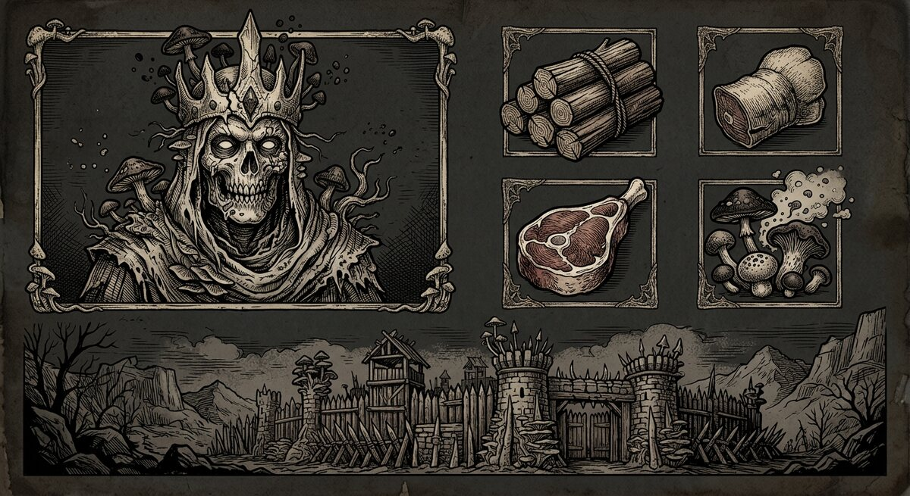
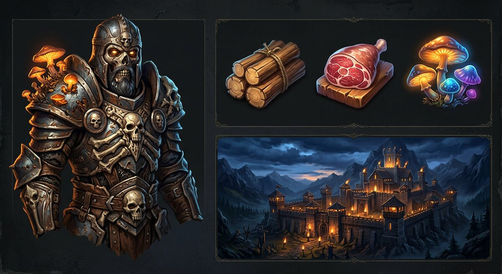
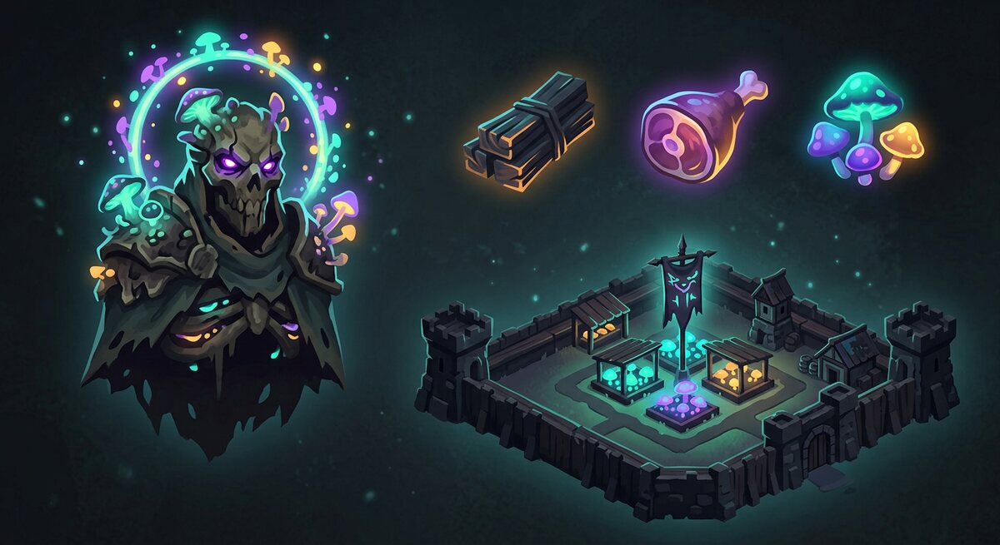

# Вид игры: UI, UX и стиль

Документ о том, **как выглядит и ощущается игра** — и почему именно так. Написан 25.09.2026 по поручению
заказчика: «нам нужны интерфейсы, иконки, картинки — современный внешний вид веб-приложения, адаптивный,
анимационный, интересный и привлекательный», «нужно учитывать тренды и желания игроков на 2025–2026 год»,
«в первую очередь анализ и обсуждение».

Статус: **проект на обсуждение.** Решения записываются в [06-plan.md](06-plan.md) после утверждения.
Числа и цифры рынка — из источников (список в конце). Наши технические нормативы помечены как **предлагаемые**.
Связанные документы: [02-tone.md](02-tone.md) — голос и правила текста, [03-first-session.md](03-first-session.md) —
первый запуск, [16-money.md](16-money.md) — прибыль и удержание, [06-plan.md](06-plan.md) — шаги.

---

## 0. Решения заказчика

- **UI ведём параллельно с разработкой**, а не «когда-нибудь потом» (25.09.2026).
- **Стиль выбирается по анализу рынка и отзывов игроков**, а не по вкусу разработчика (25.09.2026).
- Раньше заказчиком уже принято: графика временная до листа вида; лист вида утверждается **до показа двора
  кому-то кроме разработки** ([06-plan.md](06-plan.md) шаг 3); узнаваемость лорда — по имени, портрету и знамени,
  а не по конструктору лица ([03-first-session.md](03-first-session.md)).

---

## 1. Рынок 2025–2026: что зарабатывает и что скачивают

| Показатель | Значение | Источник |
|---|---|---|
| Выручка жанра «стратегии», 2025 | **$17,5 млрд**, 5,4 млрд загрузок | Sensor Tower / Statista через Quantumrun |
| №1 по выручке за 2025 среди стратегий | **Last War: Survival** — ~$1,57 млрд (+42% за год) | AppMagic |
| №2 | **Whiteout Survival** — ~$1,40 млрд | AppMagic |
| №3 (новинка года) | **Kingshot** — ~$448 млн, вошла в топ-15 мира | AppMagic / Business of Apps |
| Last War и Whiteout вместе | ~$3 млрд за год; за 19 месяцев Last War — **$2,44 млрд** | AppMagic / Sensor Tower (Singular) |
| Выручка на одну установку (Whiteout) | **$20,83**, при том что по загрузкам игра лишь ~54-я | Singular |
| ARPDAU (iOS, США) | Last War **$2,47** против Whiteout **$1,08** | Naavik |
| Удержание верхней четверти 4X | D1 **45–55%**, D7 20–25%, D30 10–15% | ThinkingData |

**Три вывода, важных для вида игры:**

1. **Жанр зарабатывает удержанием, а не количеством установок.** $20,83 с одной установки при 54-м месте
   по загрузкам означает: выигрывает не тот, кто ярче в сторе, а тот, кого не бросают. Вид игры обязан
   работать на **возврат** (понятный вход, отсутствие раздражения), а не на «вау» в первые 30 секунд.
2. **Наш клиент — не магазин приложений**, а браузер. У нас нет скриншотов в сторе, зато есть **0,34 секунды
   до игры** и никаких «скачай 500 МБ». Это наш вид-козырь: игра открывается быстрее, чем у конкурента
   грузится логотип.
3. **Верхушка жанра — это ровно наши ориентиры по механикам:** Whiteout, Last War, Kingshot. Значит, вид
   должен читаться как «игра того же класса», но с отличием, за которое нас не будут ругать (разделы 2–3).

---

## 2. Что игроки 2025–2026 хвалят (и почему это тоже про UI)

| Что хвалят | Что это значит для нас |
|---|---|
| **Игра совпадает с рекламой.** Last War обыграл свою же рекламу в кампании с актёром: «разработчики сделали настоящую игру по фейковой из рекламы» | наш ролик показывает **реальный интерфейс и реальную механику**, без «фейковой мини-игры»; это дешевле и не даёт оттока |
| **Быстрый вход без установки** | грузим мгновенно, показываем двор сразу, обучение — не дольше 3 минут |
| **Читаемая сцена и понятный HUD** | карта — центр, действия — в нижней трети, ресурсы — компактной полосой |
| **Тёмная тема как основная** | у нас палитра и так тёмная (`#0c0a09` + кость `#d8d2c4`); делаем её **первичной**, а не «инверсией» |
| **Микроанимации и отклик на нажатие** | 150–250 мс, короткие и осмысленные; каждая цифра меняется с движением, не «прыгает» |
| **Отсутствие всплывающих окон** | сводка и лента вместо модалок; окно — только в ответ на действие игрока |
| **Доступ к цифрам и тултипам** | «сколько даст», «сколько идти», «чем закончилось» — всегда в один тап |
| **Возможность уйти и удалить аккаунт** | в отзывах Whiteout это прямое обвинение: «разработчики сделали удаление аккаунта невозможным». Делаем удаление **в два тапа** и пишем об этом на виду |
| **Игра в один палец** | 75% взаимодействий с телефоном — одним большим пальцем; главные действия обязаны быть в «зоне пальца» |

---

## 3. За что ругают (и как наш вид это лечит)

Разбор отзывов App Store, Reddit и аналитики (Naavik) по верхушке жанра — три устойчивые претензии:

| Претензия игроков | Дословный смысл | Что делаем мы |
|---|---|---|
| **«Реклама — не игра»** (десятки отзывов в 1 звезду) | реклама показывает не то, что в игре; «bait and switch» | реклама = запись нашего экрана. Никаких «мини-игр», которых нет. Это же требование к слайдам привлечения |
| **«Донат-буллинг»**: «киты сжигают тех, кто не платит» | страховка прогресса у сильных и наказанное время у слабых | работаем по [16-money.md](16-money.md): потолок один для всех, прогресс не отнимается, полоса соперников, защита новичка |
| **«Меня завалили окнами»** (4X-сообщество: «уберите повторяющиеся поп-апы») | модалки не по действию игрока, десять ресурсов на панели, «ощущение работы» вместо игры | правило: **одно окно — одна задача**, всё вторичное — в сводку и ленту; ресурсы — иконки с цифрами под пальцем, полный список — по тапу |
| **«Выглядит как AI-поделка»** | в 2025–2026 игроки чувствительны к «AI-виду»: симметрия, лишние пальцы, мыльные текстуры | согласованная спецификация, единый художник или единая нарисованная система; ассеты проверяются по чек-листу (силуэт, анатомия, читаемость в 24 px) |
| **«Дорого и мелко»**: нечитаемые иконки, лишний вес | слабые телефоны, дорогой трафик | бюджет веса и света (раздел 6): вектор вместо растра там, где можно |

**Важно:** все три игры-лидера собрали миллиарды **и одновременно** имеют поток жалоб в 1 звезду. Значит,
«делать как они» — не значит «повторять их ошибки». Наша позиция: **тот же класс игры, но без того, за что
их ненавидят.** Это не только этика — это готовая рекламная формулировка и причина выбрать нас.

---

## 4. Три направления стиля (выбор за вами)

Ниже — три нарисованных концепта. В каждом: лорд, три ресурса, основа. Это **не финальный арт**, а проверка
читаемости и настроения (временная графика до листа вида — ваше решение).

### Концепт А. «Хроника» — гравюра

Штриховая гравюра, костяной тон, рамки-клейма. Тонально идеален: «хроника» и «мясо» без мультяшности,
лорд читается как чужая знакомая фигура.

- **Плюсы:** узнаваемость 100% — такой игры в жанре нет; дешевле в производстве (вектор, штрих, мало цвета);
  рамки и текстуры переиспользуются; отлично ложится на наш голос ([02-tone.md](02-tone.md)).
- **Минусы:** выглядит «старинно», а не «современно»; иконки ресурсов в 24 px превращаются в кашу (мелкий
  штрих); плохо конвертит в рекламе — человек не поймёт, что это стратегия о развитии; тёмная гравюра
  с низким контрастом тяжела на ярком солнце.
- **Кому подходит:** если хотим нишевую «литературную» игру с сильным лицом и малой конкуренцией.

### Концепт Б. «Премиум» — полуреализм

Полуреалистичные материалы, тёплый свет, объём, детализированный лорд. Это **доминирующий вид жанра**:
так выглядят Whiteout, Last War, Kingshot, Evony.

- **Плюсы:** мгновенно понятен игроку («это стратегия про развитие»); дорого выглядит; персонажи хорошо
  продаются как коллекция; в рекламе конвертит лучше всего.
- **Минусы:** самый дорогой в производстве (рендеры, текстуры, свет); легко скатиться в «AI-вид», за который
  ругают; конкурировать придётся лицом к лицу с бюджетными играми с миллиардной выручкой; тяжёлые ассеты
  против слабых телефонов и веба.
- **Кому подходит:** если хотим встать «в один ряд» с лидерами и готовы платить за арт.

### Концепт В. «Спора» — стилизованный 2.5D

Плоские выразительные силуэты, биолюминесцентная палитра (бирюза, фиолет, янтарь по почти чёрному),
изометрия. Самое читаемое из трёх на маленьком экране.

- **Плюсы:** лучшая читаемость на 390 px; дешевле полуреализма; светящееся свечение — отличный «язык» для
  наград, которые приятно получать (иконки прямо просятся «засветиться»); легко анимировать (простые формы).
- **Минусы:** «казуальный» вид может снизить ощущение серьёзных ставок (а у нас замок можно потерять);
  хуже продаёт «премиум»-предметы; свечение дорого на слабых GPU (blur и glows — беречь).
- **Кому подходит:** если ставим на скорость разработки, читаемость и молодую аудиторию.

### Моя рекомендация: **Б как основа + А как язык интерфейса + свет от В**

Гибрид, и вот почему он лучше каждой части по отдельности:

- **Основа (персонажи, двор, карта, крупные иконки) — полуреализм Б.** Игрок за три секунды понимает, что
  это за игра, и что тут есть за что платить. Это язык рынка, и спорить с ним дороже, чем принять.
- **Интерфейсные панели, рамки, знамёна, свитки, награды — графика А.** Гравюрная рамка и клеймо дают
  узнаваемость **бесплатно** (один раз нарисованные, они переиспользуются в сотнях мест) и работают на тон
  «хроники». Именно тут наша игра будет отличаться от Whiteout, не конкурируя с ним арт-бюджетом.
- **Свет — от В:** бирюзово-янтарная спора вместо тёплого огня. Одна деталь, которая делает «а это другая
  игра». Она же — язык наград: то, что светится, то и ценно.

**Что это даёт в деньгах:** премиум-вид продаёт (B), а отличительная система рамок и свечения делает нас
узнаваемыми без расходов уровня Century Games. При этом всё, что дорого (большие рендеры), мы делаем
**мало и в правильных местах** (лорд, двор, 3–4 командира), а всё массовое (иконки, панели, кнопки) —
в дешёвом векторном языке.

---

## 5. Правила интерфейса (наши обязательные)

1. **Карта — сцена, интерфейс — рамка.** Центр экрана показывает мир; интерфейс живёт по краям.
2. **Всё главное — в нижней трети.** 3–5 пунктов навигации с подписями (иконка + слово), цели не меньше
   44–48 px. Верхний край — только статус (ресурсы, щит, часы).
3. **Одно окно — одна задача.** Никаких модалок «сами собой»: событие приходит в ленту, окно открывает игрок.
   Повторяющиеся уведомления — в **сводку** (аналог «отчёта» в жанре), а не в лицо.
4. **Глубже — по желанию.** Сложность раскрывается по мере игры: сначала «построй → собери → отправь»,
   потом тонкости. Всё доступно, но не вывалено.
5. **Числа честные и на виду:** «даст столько», «идти столько», «останется столько». Без «примерно» там,
   где есть точное значение.
6. **Отклик на каждое нажатие:** микроанимация + тактильный отклик (где телефон поддерживает). Нажатие,
   которое ничего не сделало видимым образом, — ошибка.
7. **Тексты по [02-tone.md](02-tone.md):** шутка — в хронике и подписях, не на кнопках, не на экране
   поражения, не на экране победы.
8. **Состояния проектируются заранее:** пусто (ещё не строил), идёт (таймер), готово, ошибка (нет связи,
   нет места, нет ресурса), заблокировано (не по уровню). Чаще всего забывают «пусто» — у нас наоборот.
9. **Жесты — только как ускорение, не как обязательный способ:** свайп по карте, пинч-зум; то же доступно
   кнопками.
10. **Ориентация: портрет — основной.** Так держат телефон в 90% случаев и в веб-приложении; телефон
    в ландшафте оставляем широкой раскладкой (планшет, 768/1280), но интерфейс не должен требовать поворота.
11. **Оффлайн и рестарт не пугают:** таймеры живут на сервере (уже сделано), интерфейс показывает «мир идёт»
    без игрока, а не «подключение».

---

## 6. Техника и доступность (веб-приложение)

**Доступность — не «плюс», а требование:** контраст текста не ниже 4,5:1; состояние не передаётся только
цветом (нужен ещё значок или форма); цели 44+ px; уважение к `prefers-reduced-motion`; безопасные зоны
`safe-area-inset` (вырезы экранов) — у нас уже включено.

**Производительность важнее модности.** Свечение, размытие и «стекло» (glassmorphism) — тренд 2026 года,
но на дешёвых телефонах они съедают батарею и кадры. Решаем так: размытие и свечение — только на оверлеях
и только когда устройство справляется (проверка `deviceMemory`/`hardwareConcurrency` и замер кадров);
иначе — плоская замена. Анимации — только `transform` и `opacity`, 150–250 мс, 60 кадров в секунду в бою
и не ниже 30 в остальном.

**Предлагаемые бюджеты веса** (обсудить и утвердить — это норматив, не баланс игры):

| Часть | Норматив |
|---|---|
| Первый экран (оболочка + шрифты) | ≤ 300 КБ до первой отрисовки |
| Иконка ресурса, вектором | ≤ 3 КБ на иконку |
| Портрет (WebP/AVIF) | ≤ 80 КБ |
| Шрифты | 2 начертания, кириллица + латиница, ≤ 120 КБ суммарно, локально (без внешних CDN) |
| Догрузка мира (двор, карта) | ≤ 1,5 МБ при первом входе, остальное — по требованию |

**Правило ассетов:** вектор (`SVG`) — для иконок, панелей, рамок, знамён; растр — только для персонажей,
двора и карты. Спрайт для мелких картинок — один запрос вместо двадцати.

---

## 7. Что именно рисуем для первой играбельной версии

Минимальный набор ассетов (шаги 4–9), без которого игру показывать нельзя:

| Группа | Состав | Сколько |
|---|---|---|
| Ресурсы | дерево, мясо, камень, металл, грибы (5) + 3 состояния запаса (полный/норма/нет) | 5 иконок + рамки |
| Двор | 8 построек × 3 уровня вида (низкий/средний/верхний) + пустой участок | ~27 картинок |
| Лорд | портрет, аватар-кружок, знамя, 3 типа лорда | 5–6 |
| Командиры | 3 командира × портрет + иконка навыка | 6–8 |
| Марш и бой | марш-точка, меч, щит, ранение, смерть, победа/поражение | ~10 |
| Интерфейс | панель, кнопка (3 состояния), таймер, полоса, рамка награды, «свечение споры» | ~15 |
| Вступление | 8 кадров (уже есть нарисованные — заменим на премиум-язык) | 8 |

**Итого — около 80–90 ассетов.** Это делается поэтапно: сначала язык (палитра, рамка, свет), потом массовые
иконки, потом персонажи. Наём иллюстратора — на персонажей и двор (там, где нужен вкус), вектор и раскладку
делаем сами.

---

## 8. Как ведём параллельно (не ломая план)

Шаги 1–14 не переставляем. Добавляем **шаг 3.5 «Лист вида и набор интерфейса»** — он идёт параллельно шагу 4:

1. **Лист вида** (утверждаете вы): палитра, шрифты, свет, одна рамка, один портрет, один замок, три ресурса.
   Это то, что [06-plan.md](06-plan.md) уже требует до показа двора.
2. **Набор интерфейса (UI-кит):** кнопка, панель, полоса, таймер, окно, лента, иконка в трёх размерах.
   Всё — на наших токенах (`styles.css`).
3. **Три эталонных экрана:** Двор, Карта, Отчёт боя. По ним проверяем читаемость на 390/768/1280.
4. **Правило без исключений:** экраны шагов 4–9 не изобретают вид, а собираются из набора. Новое в
   набор добавляется осознанно, а не «по месту, где приспичило».
5. **Арт заказывается под спеку набора** (размеры, фон, отступы) — не наоборот.

Почему так: экраны 4–9 — это двор, карта, командир, бой, отчёт — то есть **почти весь экранный состав игры**.
Если сделать набор до них, каждый следующий шаг будет собираться быстро и одинаково. Если после — переделывать
придётся всё, и это дороже в разы (проверено всеми, кто делал наоборот).

---

## 9. Риски

| Риск | Чем грозит | Как закрываем |
|---|---|---|
| Полуреализм «как у всех» | нас не отличить от Whiteout, реклама дороже | отличие даёт система рамок и свет споры, а не лорд |
| Арт дороже плана | разработка встанет из-за картинок | поэтапность: язык → массовые иконки → персонажи; наём — точечно |
| «AI-вид» и ругань | репутация, отзывы | единая спецификация, один художник на серию, чек-лист проверки |
| Звёзды, свечение, стекло на слабых телефонах | лаги, отток | проверка устройства, замена на плоский вариант, бюджеты веса |
| Интерфейс расползётся по экранам | разнобой, переделки | UI-кит и правило «экраны берут компоненты кита» |
| Ландшафт потребуют игроки | переделка раскладки | портрет основной, ландшафт — широкая раскладка, не обязателен |

---

## 10. Вопросы к заказчику

| № | Вопрос | Варианты | Что рекомендую |
|---|---|---|---|
| 1 | **Стиль** | А гравюра / Б премиум / В спора / гибрид Б+А+свет | **гибрид** (раздел 4) |
| 2 | Насколько тёмным делать вид | «как сейчас» (почти чёрный) / чуть светлее для улицы | чуть светлее фонов + контраст на тексте (читаемость на солнце) |
| 3 | Звук | тишина / клики и бой / музыка + клики | тихо по умолчанию, музыка в слайдах (уже есть), звуки — после фундамента |
| 4 | Настроение двора | «живой, но тревожный» / «спокойная крепость» / «страшный» | «живой, но тревожный» — по тону хроники |
| 5 | Кто рисует | сами вектором / наём на персонажей | наём на лорда, командиров и двор; остальное сами |

---

## Источники

- Выручка и загрузки жанра, топы 2025–2026: <https://www.quantumrun.com/consulting/mobile-game-statistics/>,
  <https://www.businessofapps.com/data/top-grossing-games/>, <https://www.singular.net/blog/top-mobile-games/>
- Мисматч рекламы и удержания, ARPDAU, разбор Last War: <https://naavik.co/digest/how-last-war-is-winning-the-4x-game/>
- Жалобы игроков (фейковая реклама, донат-буллинг, невозможность удалить аккаунт, поп-апы):
  <https://apps.apple.com/us/app/whiteout-survival/id6443575749?see-all=reviews>,
  <https://www.reddit.com/r/whiteoutsurvival/comments/1m4mif3/>,
  <https://www.reddit.com/r/whiteoutsurvival/comments/1hki2e9/>,
  <https://www.reddit.com/r/4Xgaming/comments/1qnl1qk/>
- Тренды мобильного UI 2026 (нижняя навигация, «зона пальца», тёмная тема как основа, стекло, микроанимации):
  <https://www.designstudiouiux.com/blog/mobile-app-ui-ux-design-trends/>,
  <https://muz.li/blog/whats-changing-in-mobile-app-design-ui-patterns-that-matter-in-2026/>,
  <https://www.vikalpdevelopment.com/top-10-mobile-app-ux-ui-trends-2026/>
- Стили мобильного арта (полуреализм как «премиум», стилизация против реализма) и риски AI-арта:
  <https://www.zvky.com/blogs/articles/top-7-art-styles-dominating-mobile-games-in-2025>,
  <https://omisoft.net/blog/mobile-game-art-guide-2025-styles-tools-and-best-practices/>,
  <https://www.theguardian.com/games/2025/jun/26/video-game-developers-using-ai-even-when-they-arent-stamina-zero>
- Ориентация и одна рука: <https://www.gameanalytics.com/blog/mobile-desktop-ui-design>,
  <https://umjynb-lab.github.io/gameorientation/>
