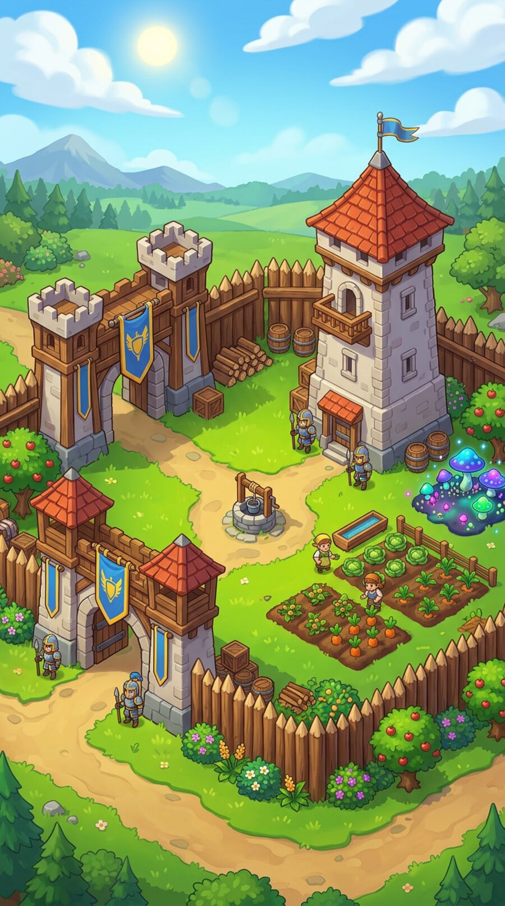
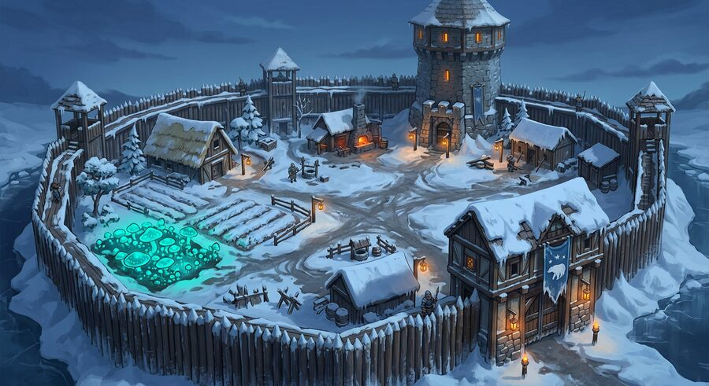
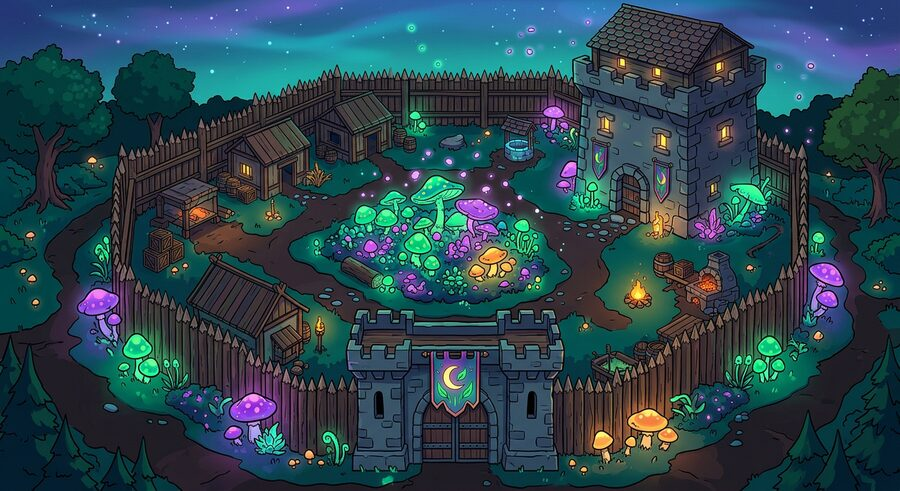

# Вид игры: план разбора и создания UI

Документ о **внешнем виде игры**. Статус: **план и обсуждение**; решения о стиле не приняты — их принимает
заказчик после разбора и вариантов.

Связанные документы: [02-tone.md](02-tone.md) — голос и правила текста, [03-first-session.md](03-first-session.md) —
первый запуск, [16-money.md](16-money.md) — прибыль и удержание, [06-plan.md](06-plan.md) — шаги работы.

---

## 0. Решения заказчика (25.09.2026)

1. **UI ведём параллельно с разработкой**, стиль выбирается по анализу, а не по вкусу.
2. **Список 12 игр для разбора утверждён** (раздел 4).
3. **Ширина разбора — всё визуальное целиком**: интерфейс, карта, бой, двор, герои как сцены.
4. **Процесс работы:** разбор и тренды → чёткий **план (скелет) создания UI** → из скелета **до 10 вариантов**
   → из большинства вариантов выбрать «идеальный» и уникальный стиль.
5. **Учитывать рекламу** и **централизацию нескольких главных элементов** — «фишки», «якоря» игры (раздел 10).
6. **Наша изюминка** — баланс строгости, шутки, сарказма и иронии проекта (по [02-tone.md](02-tone.md)).
7. **Хотим анимированный 3D-визуал**, «двигаться вровень с современным миром» (раздел 9 — что реально
   возможно и почём).

**Отменено (25.09.2026):** три первых концепта стиля и папка `docs/game/concepts/` — они строились от наброска
заглушки, а не от разбора жанра (раздел 7).

---

## 1. Порядок работы (семь этапов)

| Этап | Что делаем | Выход | Кто утверждает |
|---|---|---|---|
| **1. Разбор 12 игр** | единая карточка из 16 пунктов (раздел 5), официальные материалы | 12 карточек | заказчик принимает |
| **2. Сводка** | «роль → как решают все → разброс»; карта уникальности (где тесно, где пусто); «за что ругают → что делаем иначе» | сводная таблица | заказчик обсуждает и правит |
| **3. Скелет UI** | **план интерфейса без стиля**: экраны, раскладка, иерархия, якорные элементы, состояния, навигация, что где живёт — выведен из разбора | документ-скелет (проволочные схемы) | **заказчик утверждает** |
| **4. До 10 вариантов** | 8–10 вариантов стиля **на одном и том же скелете**: палитра, материал, форма, свет, иконки, портрет, двор | 10 изображений + таблица отличий | **заказчик выбирает** |
| **5. Лист вида** | палитра по ролям, шрифты, рамка, свет, один портрет, один замок, три ресурса, одна кнопка | лист вида | **заказчик утверждает** |
| **6. Набор интерфейса** | кнопка, панель, полоса, таймер, окно, лента, иконки трёх размеров | UI-кит в коде | правит заказчик |
| **7. Экраны** | двор, карта, отчёт; далее экраны шагов 4–9 собираются из набора | живые экраны | смотрит на устройстве |

**Правило:** ни одного решения о виде до конца этапа 1; ни одной картинки «от себя» вместо анализа.
Варианты на этапе 4 обязаны быть **на одном скелете** — иначе сравнивать нечего, и выбор превращается в лотерею.

---

## 2. Рынок: цифры

| Показатель | Значение | Источник |
|---|---|---|
| Выручка жанра «стратегии», 2025 | **$17,5 млрд**, 5,4 млрд загрузок | Sensor Tower / Statista через Quantumrun |
| №1 по выручке 2025 | **Last War: Survival** — ~$1,57 млрд (+42%) | AppMagic |
| №2 | **Whiteout Survival** — ~$1,40 млрд | AppMagic |
| Новинка года | **Kingshot** — ~$448 млн | AppMagic / Business of Apps |
| Выручка на установку (Whiteout) | **$20,83** при 54-м месте по загрузкам | Singular |
| ARPDAU (iOS, США) | Last War **$2,47** против Whiteout **$1,08** | Naavik |
| Удержание верхней четверти 4X | D1 **45–55%**, D7 20–25%, D30 10–15% | ThinkingData |

**Вывод для вида:** жанр зарабатывает тем, что игрока не бросают. Вид оценивается не по «вау», а по тому,
понимает ли человек, что делать, и возвращается ли.

---

## 3. Первые фактические наблюдения (официальные материалы)

- **Kingshot:** яркий мультяшный 3D — зелёная трава, голубое небо. Панель выбора **светлая, пергаментно-
  песочная, со скруглениями**, варианты объёмными картинками, выбранный обведён угловыми скобками; фон
  под панелью затемнён. Слева сверху — портрет лорда с числом уровня; по центру — **две шкалы времени**;
  строка ресурсов с маленькими иконками и сокращёнными числами (213,76K; 12,490,736). Мрачности нет.
- **Whiteout Survival:** **реклама ярче игры** — мультяшная сцена, зелёные ёлки, синяя плашка «Collect Resources».
  Подтверждает жалобы «в игре не то, что в ролике».
- **Rise of Kingdoms:** насыщенный мультяшный 3D, крупный харизматичный герой; ниже — **городские облики
  по цивилизациям** (Рим, Британия, Испания, Франция, Китай, Япония, Корея). Внешний вид города — товар.

**Вывод:** мрачность — не язык жанра. Яркость, контраст и читаемость — язык. Облик города продаётся.

---

## 4. Список игр для разбора (утверждён)

**Лидеры рынка:** 1. Whiteout Survival · 2. Last War: Survival · 3. Kingshot · 4. Rise of Kingdoms · 5. Evony.
**Жанровые:** 6. Game of Thrones: Conquest · 7. State of Survival · 8. Lords Mobile · 9. Call of Dragons ·
10. Warpath.
**Дополнительно:** 11. Age of Empires Mobile · 12. Puzzles & Survival · 13. King of Avalon (антипример).

---

## 5. Карточка разбора (16 пунктов, на каждую игру)

1. **Экран двора** — ракурс камеры, зум, разметка построек, показ прогресса.
2. **HUD** — что сверху (ресурсы, часы, власть) и снизу (навигация): сколько пунктов, размеры, подписи.
3. **Панели и окна** — материал и форма: пергамент, стекло, металл; скругления, тени, свечение, рамки.
4. **Кнопки** — форма, цвет, состояние (нажато/недоступно/ждёт), подача главного действия.
5. **Палитра по ролям** — фон, панель, действие, награда, опасность, редкость; сколько цветов и где золото.
6. **Иконки ресурсов** — 3D-рендер или вектор, детализация, читаемость в 24/32/48 px.
7. **Герои и лорд** — стиль, позы, фон, как продают (звёзды, редкость, облики).
8. **Карта** — сетка/свободная, маркеры, зум, зоны, «где я» и «куда идти».
9. **Бой** — как показан (марши, стрелки, цифры, полосы); что в рекламе и что в игре.
10. **Событие и календарь** — как рисуют «сегодня», таймеры, награды, вход в событие.
11. **Союз** — чат, роли, помощь, «принадлежность» в интерфейсе.
12. **Магазин** — где стоит, как подают наборы, что подсвечивают.
13. **Онбординг** — первые 5 минут: что показывают, сколько текста и окон.
14. **Фишка (уникальность)** — что делает игру узнаваемой **на одном экране**.
15. **Реклама против игры** — обещание ролика против реального экрана (наш принцип: реклама = игра).
16. **Тон и голос** — как игра шутит, где шутит и где молчит; где строгость, где ирония (сверяем с нашим
    [02-tone.md](02-tone.md): строгая рамка, ироничная подпись).

**Формат:** таблица фактов + 2–4 официальных изображения + строка «что берём / что не берём и почему» +
ссылки на источники. В конце — сводная таблица по всем играм.

---

## 6. Скелет UI — что это будет (этап 3)

Скелет — это **ответы на вопросы, а не картинки**:

1. **Карта экранов:** какие экраны есть, как между ними ходят, что где живёт (двор, карта, отряд, командир,
   отчёт, союз, события, настройки).
2. **Раскладка по зонам:** что в нижней трети (главное), что в верхней (статус), что в центре (сцена).
3. **Иерархия:** что видно всегда, что по тапу, что только в событии.
4. **Состояния:** пусто, идёт (таймер), готово, ошибка, заблокировано — для каждого элемента.
5. **Навигация:** сколько пунктов, их порядок, что открывается свайпом.
6. **Якорные элементы** (раздел 10): какие 3–5 элементов повторяются везде и становятся «лицом» игры.
7. **Роли цвета:** фон, панель, действие, награда, опасность, редкость — сколько их и где применяются.
8. **Правила плотности:** сколько информации на экран, где прячем мелочь (по жалобам «завалили окнами»).

Скелет утверждается **до** любого арта. Только потом рисуются варианты.

---

## 7. Что отменено и почему

| Отменено | Причина |
|---|---|
| Три концепта стиля (гравюра, премиум, спора) | построены от чёрно-костяной заглушки, а не от разбора жанра |
| Рекомендация «гибрид» | вывод без разбора |
| Папка `docs/game/concepts/` | удалена |
| Чёрная палитра `#0c0a09` как «основа вида» | это временная заглушка шага 3, а не решение |

---

## 8. Технические нормативы (не стиль — стандарты)

- **Зона пальца:** главные действия в нижней трети (75% взаимодействий — одним пальцем).
- **Цель нажатия ≥ 44–48 px** (уже в коде).
- **3–5 пунктов** навигации, иконка + короткая подпись.
- **Контраст текста ≥ 4,5:1**; состояние не только цветом.
- **Тёмная и светлая тема** — обе полноценные.
- **Размытие и «стекло»** — только в оверлеях и при запасе производительности.
- **Анимации 150–250 мс**, только `transform`/`opacity`; цель 60 fps в бою, 30+ в городе.
- **Вес:** первый экран ≤ 300 КБ до первой отрисовки; иконка-вектор ≤ 3 КБ; портрет ≤ 80 КБ; первый вход ≤ 1,5 МБ.
- **Никаких внешних CDN:** все ассеты (шрифты, модели, HDRI) — у нас на сервере или в бандле (в РФ внешние
  CDN нестабильны).
- **Доступность:** `prefers-reduced-motion`, `safe-area-inset` (уже включено), масштабирование шрифтов.

---

## 9. 3D, анимации и честные возможности

### 9.1 Что важно понять про «2D не в моде»

Посмотрел официальные экраны лидеров: **3D у них — это сцена** (город, карта, бой), а **интерфейс — плоский
2D** (пергаментные панели Kingshot, панели RoK поверх 3D-города). То есть «3D-игра» = 3D-сцена + 2D-интерфейс,
а не «всё 3D». Смешивать эти два слоя — типичная ошибка, из-за неё интерфейс становится тяжёлым и нечитаемым.
Наш план: **сцена — 3D, интерфейс — плоский и мгновенный.**

### 9.2 Что проверено в нашем окружении (факты)

| Проверка | Результат |
|---|---|
| `three` (ядро 3D) | доступен, **0.186.1** |
| `@react-three/fiber` (React-обвязка 3D) | доступен, **9.8.1** |
| `@react-three/drei` (готовые камеры, свет, окружение) | доступен, **10.7.9** |
| `@react-three/postprocessing` (свечение, качество) | доступен, **3.1.2** |
| `@gltf-transform/cli` (сжатие моделей) | доступен, **4.5.0** |
| `@pmndrs/assets` (готовые окружения) | доступен, **1.7.0** |
| 3D-редактор в песочнице (Blender и др.) | **нет** |
| Сайты моделей (Kenney, Quaternius, Sketchfab) | **недоступны** из песочницы |
| Ресурсы | 2 ядра, 3 ГБ памяти — хватает для кода, не для 3D-рендера |

### 9.3 Что я умею и чего не умею (прямо)

**Умею:** писать 3D-код (сцена, камера, свет, тени), шейдеры (свет грибницы, споры, туман), процедурную
геометрию — то есть **строить город и постройки кодом** из параметрических модулей (стена, башня, дом, крыша,
знамя), анимации, загрузку и сжатие моделей, постобработку, а также 2D-интерфейс и его анимации.

**Не умею:** лепить 3D-модели руками — в песочнице нет 3D-редактора, и «нарисовать» модель как картинку
нельзя. Значит, «мясистые» модели (герой, вождь, детализированный двор) — это **покупка готовых или наём
3D-художника**, а не то, что я достану из воздуха.

### 9.4 Три реальных пути (и что рекомендую)

| Путь | Как | Цена | Вид |
|---|---|---|---|
| **A. Процедурный стилизованный 3D** | город и здания **генерируются кодом** из модулей; свет и споры — шейдерами; модели-модули можно потом заменить купленными | почти только работа (модели не покупаем) | низкополигональный стилизованный 3D, «игрушечный» и яркий (как низкополи Kingshot/Brawl Stars) |
| **B. Покупные/заказные модели** | покупаем набор «фэнтези-город» или заказываем лорда, вождей, двор | от десятков до сотен тысяч ₽ | ближе к Whiteout/RoK, «премиум» |
| **C. Пре-рендер 2.5D** | 3D-сцену рендерят один раз в изображения, в игре — картинки и спрайтовые анимации | средне, нужен 3D-художник | выглядит как 3D, но камера фиксирована (нельзя вращать) |

**Рекомендую A с заделом на B:** начинаем с процедурного стилизованного 3D — он даёт **настоящую 3D-сцену**
(камера, свет, рост города на глазах), лёгкий вес и полную независимость от закупок; наш язык (грибница, споры,
свечение) отлично ложится на шейдеры. По мере денег заменяем ключевые модули (двор, лорд, вожди) на купленные
или заказанные — сцена это переживёт, потому что модульная.

### 9.5 Анимации: что именно делаем

- **Сцена:** вращение и зум камеры, рост и стройка зданий, движение маршей, живой свет, споры и туман.
- **Персонажи:** покадровые анимации из моделей (если модель с анимациями) или простое движение кодом
  (поворот, покачивание, удар) — для стилизованного вида этого достаточно.
- **Интерфейс:** микроанимации нажатий, появление панелей снизу, счёт цифр, «свечение награды» — CSS/WAAPI.
- **Награды и события:** векторные анимации (Lottie) + свечение; это то, что приятно получать.
- **Бюджет:** 60 fps в бою, 30+ в городе на среднем телефоне; на слабом — фолбэк: статичная изометрия
  вместо живой сцены, интерфейс остаётся.

### 9.6 Браузер в песочнице: выяснено на деле (поправка 25.09.2026)

Заказчик был прав: браузер **ставится**. Проверено: скачан пакет `@sparticuz/chromium` (69 МБ), распакованы
его библиотеки совместимости (`al2023`: nspr/NSS) и SwiftShader, после чего **Chromium 153.0.8010.0
запускается** и отвечает на `--version` (нужны `LD_LIBRARY_PATH`, `FONTCONFIG_FILE`, флаги `--headless
--no-sandbox`).

Но **рендеринг страницы в этом контейнере виснет**: GPU-процесс не поднимается (`GLDisplayEGL::Initialize
failed`), кадр не отдаётся. Пять наборов флагов — новый и старый headless, `--single-process`, `--no-zygote`,
SwANGLE + `--enable-unsafe-swiftshader`, отключение сети и обновлений — дают одно и то же: процесс живёт,
снимка нет (все запуски под `timeout`, чтобы не вешать среду).

**Итог:** установка — да, скриншоты — нет. Значит, кадры и «тянет ли на телефоне» смотрите вы через превью,
а я даю код, нормативы и замеры веса и размеров, которые проверяются без браузера. Если автоматическая
проверка картинки нужна — это решение о среде (внешний браузер или сервис), а не вопрос флагов.

---

## 10. Якорные элементы (фишка игры)

Ваша идея: **централизовать несколько главных элементов**, которые станут «якорем» узнаваемости. Как это
устроено у лидеров: Whiteout — снег, печь, дым; RoK — цивилизации и герои; Last War — техника и дрон.

**Наши кандидаты в якоря** (выбрать 3–5 и повторять везде — в интерфейсе, на карте, в рекламе, в иконке):

1. **Грибница и споры** — живой свет, который означает «наше». Работает как язык наград и редкости.
2. **Знамя двора** — личное и клановое, дешёвый носитель статуса (и товар — облики знамени).
3. **Хроника** — лента событий как «летопись мира»: и механика, и лицо игры, и повод шутить.
4. **Погреб с грибами** — редкий ресурс: место, куда хочется заглядывать.
5. **Частокол** — граница «своё/чужое» на карте, читается мгновенно.

**Правило якоря:** элемент обязан быть узнаваем **на одном экране и без подписи**; если для понимания нужен
текст — это не якорь.

---

## 11. Тон в интерфейсе

Из [02-tone.md](02-tone.md): «ирония — приправа, не блюдо», «на кнопках шуток нет», «шутит хронист и подписи».
Для вида это значит:

- **Рамка и форма — строгие** ( никакого клоунского шрифта и радуги на весь экран).
- **Ирония — в микротекстах и деталях**: подпись к пустому полю, фраза хрониста в ленте, название нелепого
  здания, реплика при провале, но **не на экране поражения и не на кнопке**.
- **Серьёзность ставок** читается из оформления (щит, стены, потери), а шутка — рядом, тонкой линией.

---

## 12. Что нужно от заказчика

| № | Вопрос | Варианты |
|---|---|---|
| 1 | Порядок этапов (раздел 1) | утвердить / поправить |
| 2 | Скелет: сначала 1 эталонный экран (двор) как образец скелета, потом остальные | образец / сразу все экраны |
| 3 | **Прототип 3D-сцены** (проверка на вашем телефоне до всего остального) | делаем / сначала скелет и разбор |
| 4 | Якорные элементы (раздел 10) | выбрать 3–5 из списка / добавить свои |
| 5 | Путь 3D (раздел 9.4) | A процедурный / B покупные модели / A с заделом на B (рекомендую) |

---

## 13. Разбор партии 1 (25.09.2026): Whiteout · Last War · Kingshot · RoK

Смотрел **настоящие экраны игры** (скриншоты из магазинов приложений и гайдов), а не описания. Ниже — только
то, что видно глазами.

### 13.1 Whiteout Survival — панель постройки

Экран: панель печи/кухни поверх затемнённой сцены.

- **Шапка панели** — тёмно-синяя полоса: слева название и уровень («Cookhouse Lv. 8») с иконкой подсказки,
  **справа — ярко-синяя кнопка улучшения**.
- **Тело панели** — светлое, контрастное к шапке: слева превью здания (скруглённый квадрат с картинкой),
  рядом название и одна строка описания обычным текстом.
- **Чипы характеристик** — узкие скруглённые плашки в два ряда: «Production 🍗 1», «Cost 🥩 464.11K/150»,
  «Stats 🍖 50», «Time ⏱ 3.4S **−0.2S**». Скидка времени написана **зелёным прямо рядом с временем**.
- **Сетка плиток** — 5 столбцов × 3 ряда: светлые квадраты с зданием, уровень числом в углу
  («16», «14») и **зелёным плюсом** у тех, что можно улучшить; выбранная обведена **голубыми угловыми
  скобками**.
- **Низ — две вкладки** во всю ширину: «Furniture» / «Survivor», активная светлее.
- **Числа** сокращённые: «464.11K», «3.4S», вверху счётчик «0/24» красным и зелёным.
- **Палитра:** тёмно-синий, светло-голубые плитки, белый текст, золото на цене, **зелёный = выгода**.

### 13.2 Last War: Survival — двор

- **Сцена:** изометрия, яркая зелень, песочные дорожки, насыщенные постройки; читается мгновенно.
- **Бейджи над зданиями:** круглые белые облачка с иконкой (молоток — есть что строить, посылка, маска,
  монета) висят прямо над постройкой; это главный способ сказать «сюда смотри».
- **Флаг в центре двора** — национальный (Испания): принадлежность вынесена в центр сцены.
- **Боковая колонка** круглых кнопок слева; чат — отдельной круглой кнопкой.
- **Палитра:** самая яркая из четырёх; синий и оранжевый на зелёном.

### 13.3 Rise of Kingdoms — карта и город

- **Карта:** реалистичный рельеф **без сетки**, огромный зум-аут, поверх — маркеры армий; посередине
  надпись расстояния («232 KM»).
- **Верхняя строка:** портрет с уровнем слева, затем **семь ресурсов** подряд: «3,387,325», «2,584,620»,
  «7,6M», «8,7M», «3,6M», «1,5M», «170» — и **полные числа, и сокращённые в одном экране** (наследие
  старого интерфейса).
- **Правая колонка** — 6–7 круглых кнопок с золотыми иконками (почта, поиск, события, подарки, чат).
- **Чат союза виден прямо на карте** — социальное не спрятано в меню.
- **Город:** плотная изометрия, много украшений, стены; отдельный экран.
- **Палитра:** насыщенная зелень, серый камень, золото.

### 13.4 Kingshot — выбор объекта

- **Модальная карточка:** светло-пергаментная, крупные скругления; шапка светлее тела.
- **Два варианта в ряд**: объёмный 3D-рендер на светло-голубом квадрате, под ним название обычным текстом;
  выбранный обведён **теми же голубыми угловыми скобками**, что у Whiteout.
- **Сцена за карточкой затемнена**; поверх — **синяя плашка-баннер с крупной надписью заглавными**
  («CHOOSE YOUR TOWER») — подача «событийности».
- **Верх:** портрет лорда в короне с золотым бейджем уровня слева; чипы времени и валют справа
  («23:06», «32/32», «213,76K», «12,490,736»).

### 13.5 Сводка: что у жанра общее (это и есть язык)

| Место | Как решают все четыре | Вывод для нас |
|---|---|---|
| Верхний край | портрет слева + чипы времени и ресурсов, числа сокращённые | берём: компактная строка, не более двух рядов |
| Нижний край | 5 пунктов с иконкой и подписью; у RoK — колонка круглых кнопок сбоку | берём нижнюю навигацию из 5; боковую колонку — для редких действий |
| Сцена | изометрия 3/4, яркая, плотная, «игрушечная» | берём изометрию; яркость — да |
| Панель | снизу; шапка тёмная, **главная кнопка справа в шапке** | берём: главное действие в шапке панели, справа |
| Выбор | **голубые угловые скобки** (Whiteout и Kingshot) | берём: это уже стандарт жанра |
| Плитки | сетка 5×3, уровень числом в углу, **зелёный «+» у доступных** | берём: зелёный «+» = «можно улучшить» |
| Выгода | зелёный цвет времени и скидок («−0.2S») | берём: зелёный — язык выгоды, не украшение |
| Внимание | круглые бейджи над объектами (Last War) и цифры-счётчики (Whiteout) | берём: 3–5 бейджей максимум, иначе шум |
| Социальное | чат на карте у RoK, флаг двора у Last War | берём: принадлежность видна на сцене |
| Числа | сокращения «K», «M» рядом с точными | берём сокращения, но **точное число — в один тап** |
| Модальные окна | затемняют сцену, но **сами не открываются** — открывает игрок | берём: у нас окно только по действию |

**Чего не берём:** семь ресурсов в строке (RoK) — у нас пять, и лучше не расширять; смесь полных и
сокращённых чисел в одном ряду; рекламные плашки поверх игры (это приём магазина, не интерфейса).

### 13.6 Наша изюминка (черновик, обсуждать)

Три вещи, которых нет ни у кого из четырёх, и они наши по лору:

1. **Свет как язык наград.** У всех «сочность» — это блеск и золото. У нас — **спора и свечение грибницы**:
   чем ценнее, тем заметнее свет. Это и отличает, и не мешает читаемости.
2. **Хроника вместо цифры.** У всех уведомления — красная точка и число. У нас — **строка летописи**
   голосом хрониста: и событие, и повод для иронии (по [02-tone.md](02-tone.md), без шуток на кнопках).
3. **Строгая рамка, живая сцена.** Рамки панелей и меню — сдержанные и «книжные», а сцена — живая
   и растущая. Контраст «строгий документ + живой двор» узнаётся на одном экране.

---

## 14. Макет: что сделано и что проверить

Собран **живой макет двора** — файл `docs/game/ui/mockup.html`, открывается с телефона (превью на порту 8080).
Это **скелет в коде**, а не финальный вид: цвета — переменные, картинка сцены — тестовая и переключается.

**Что в макете (по итогам §13):**

- верх: портрет лорда с уровнем, часы мира, **зелёный чип выгоды**, строка из пяти ресурсов с сокращениями;
- сцена: изометрия двора (тестовая картинка — 4 настроения, переключатель внизу слева);
- **бейджи над объектами**: молоток (есть что строить) и галочка с числом (готово);
- **боковая колонка** круглых кнопок (почта, события, союз) — приём RoK;
- **нижняя навигация из 5 пунктов** с иконкой и подписью, в зоне пальца;
- **панель постройки снизу**: тёмная шапка, название с уровнем, **«Улучшить» справа в шапке**, чипы
  характеристик (включая зелёную экономию времени), сетка **5×3** с уровнем в углу и зелёными «+»,
  выбранная плитка — голубыми скобками, низ — две вкладки;
- свайп вниз по шапке закрывает панель; кнопка «Улучшить» показывает состояние «улучшается».

**Что проверить заказчику (по пунктам, на телефоне):**

1. Читается ли строка ресурсов на 390 px и не мелко ли.
2. Пять пунктов внизу — удобно ли большим пальцем, хватает ли подписей.
3. Панель постройки: понятно ли с первого взгляда, что улучшить и сколько это стоит.
4. Бейджи: помогают или мешают (сколько их терпимо).
5. Настроения сцены (кнопки 1–4): какое ближе — яркое дневное, холодное, крафтовое или светящееся ночное.
6. Чего не хватает на экране двора, что лишнее.

**Важно:** этот макет — **скелет**. Стиль (палитра, материал рамок, шрифт, свет) ещё не выбран; когда
выберем — меняются только переменные в начале файла, раскладка остаётся.

### 14.1 Тестовые генерации (тот же ракурс, четыре настроения)

Один и тот же сюжет — двор с частоколом, башней, воротами и грибной грядкой — в четырёх настроениях.
Это **не варианты стиля целиком**, а проверка: как скелет читается на разном свете и цвете.

| № | Настроение | Изображение |
|---|---|---|
| 1 | Яркое дневное (язык Kingshot/Last War) |  |
| 2 | Холодное сумеречное (язык Whiteout) |  |
| 3 | Крафтовое земляное (своё, «дерево и кость») |  |
| 4 | Светящееся ночное (наша спора) |  |

В макете эти же четыре картинки переключаются кнопками 1–4 внизу слева — можно смотреть, как панели
и бейджи ведут себя на каждом фоне.

---

## Источники

- Официальные материалы: страницы Kingshot, Whiteout Survival, Rise of Kingdoms в магазинах приложений
  и на официальных сайтах (скриншоты и арт).
- Выручка и загрузки жанра: <https://www.quantumrun.com/consulting/mobile-game-statistics/>,
  <https://www.businessofapps.com/data/top-grossing-games/>, <https://www.singular.net/blog/top-mobile-games/>
- Реклама и удержание: <https://naavik.co/digest/how-last-war-is-winning-the-4x-game/>,
  <https://apps.apple.com/us/app/whiteout-survival/id6443575749?see-all=reviews>,
  <https://www.reddit.com/r/whiteoutsurvival/comments/1m4mif3/>,
  <https://www.reddit.com/r/4Xgaming/comments/1qnl1qk/>
- Нормативы интерфейса: <https://www.gameanalytics.com/blog/mobile-desktop-ui-design>,
  <https://muz.li/blog/whats-changing-in-mobile-app-design-ui-patterns-that-matter-in-2026/>,
  <https://thinkingdata.io/blog/key-kpis-for-4x-strategy-mobile-game-success/>
